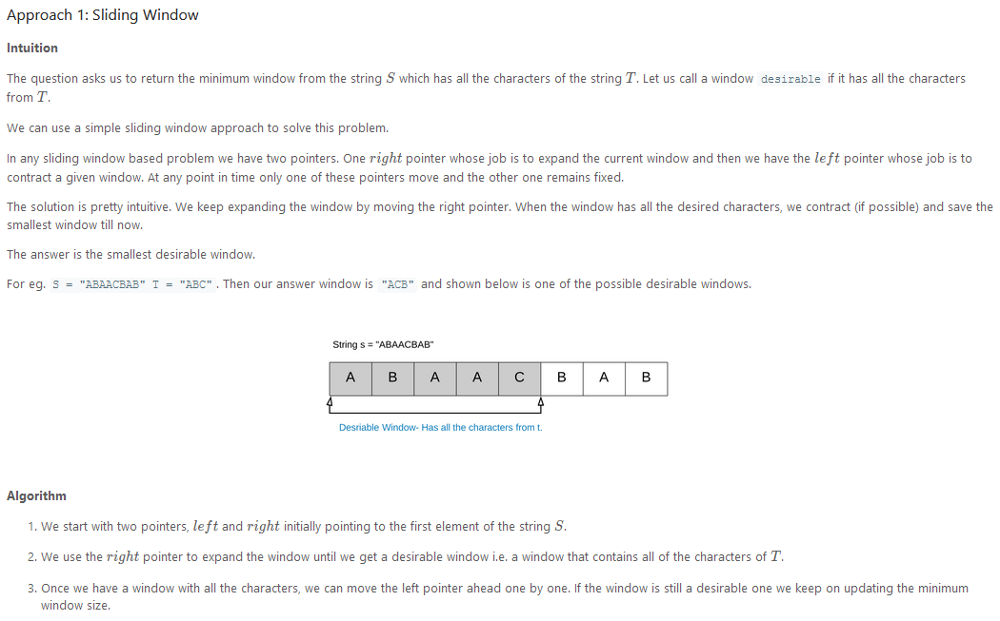
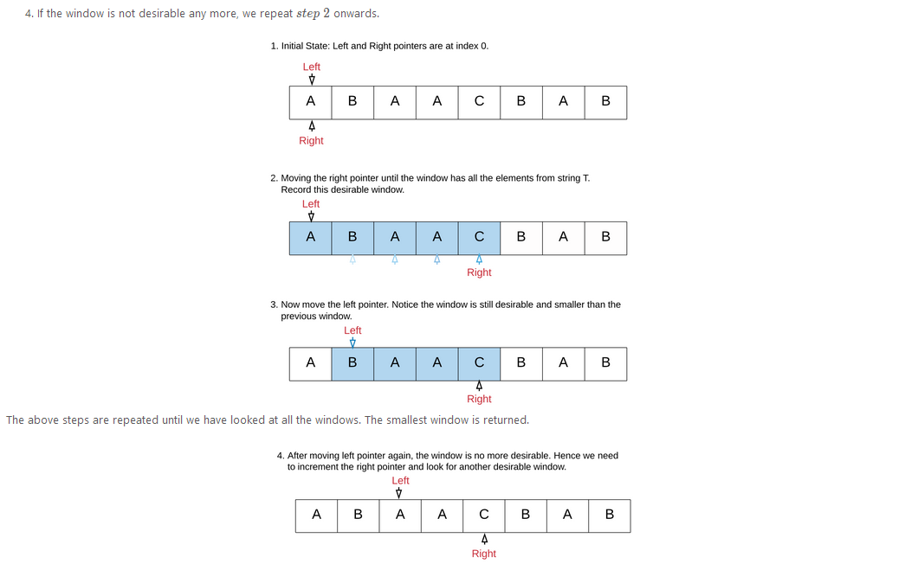
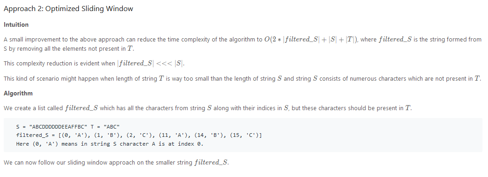

# Minimum Window Substring

Given a string S and a string T, find the minimum window in S which will contain all the characters in T in complexity O(n).

### Example:

```
Input: S = "ADOBECODEBANC", T = "ABC"
Output: "BANC"
```

### Note:

- If there is no such window in S that covers all characters in T, return the empty string `""`.
- If there is such window, you are guaranteed that there will always be only one unique minimum window in S.

---

### Solution:

---





**Implementation**

```
class Solution {
  public String minWindow(String s, String t) {

      if (s.length() == 0 || t.length() == 0) {
          return "";
      }

      // Dictionary which keeps a count of all the unique characters in t.
      Map<Character, Integer> dictT = new HashMap<Character, Integer>();
      for (int i = 0; i < t.length(); i++) {
          int count = dictT.getOrDefault(t.charAt(i), 0);
          dictT.put(t.charAt(i), count + 1);
      }

      // Number of unique characters in t, which need to be present in the desired window.
      int required = dictT.size();

      // Left and Right pointer
      int l = 0, r = 0;

      // formed is used to keep track of how many unique characters in t
      // are present in the current window in its desired frequency.
      // e.g. if t is "AABC" then the window must have two A's, one B and one C.
      // Thus formed would be = 3 when all these conditions are met.
      int formed = 0;

      // Dictionary which keeps a count of all the unique characters in the current window.
      Map<Character, Integer> windowCounts = new HashMap<Character, Integer>();

      // ans list of the form (window length, left, right)
      int[] ans = {-1, 0, 0};

      while (r < s.length()) {
          // Add one character from the right to the window
          char c = s.charAt(r);
          int count = windowCounts.getOrDefault(c, 0);
          windowCounts.put(c, count + 1);

          // If the frequency of the current character added equals to the
          // desired count in t then increment the formed count by 1.
          if (dictT.containsKey(c) && windowCounts.get(c).intValue() == dictT.get(c).intValue()) {
              formed++;
          }

          // Try and contract the window till the point where it ceases to be 'desirable'.
          while (l <= r && formed == required) {
              c = s.charAt(l);
              // Save the smallest window until now.
              if (ans[0] == -1 || r - l + 1 < ans[0]) {
                  ans[0] = r - l + 1;
                  ans[1] = l;
                  ans[2] = r;
              }

              // The character at the position pointed by the
              // `Left` pointer is no longer a part of the window.
              windowCounts.put(c, windowCounts.get(c) - 1);
              if (dictT.containsKey(c) && windowCounts.get(c).intValue() < dictT.get(c).intValue()) {
                  formed--;
              }

              // Move the left pointer ahead, this would help to look for a new window.
              l++;
          }

          // Keep expanding the window once we are done contracting.
          r++;
      }

      return ans[0] == -1 ? "" : s.substring(ans[1], ans[2] + 1);
  }
}
```

**Complexity Analysis**

- Time Complexity: O(∣S∣+∣T∣)O(|S| + |T|)O(∣S∣+∣T∣) where |S| and |T| represent the lengths of strings SSS and TTT. In the worst case we might end up visiting every element of string SSS twice, once by left pointer and once by right pointer. ∣T∣|T|∣T∣ represents the length of string TTT.

- Space Complexity: O(∣S∣+∣T∣)O(|S| + |T|)O(∣S∣+∣T∣). ∣S∣|S|∣S∣ when the window size is equal to the entire string SSS. ∣T∣|T|∣T∣ when TTT has all unique characters.

---




**Implementation**

```
class Solution {
    public String minWindow(String s, String t) {

        if (s.length() == 0 || t.length() == 0) {
            return "";
        }

        Map<Character, Integer> dictT = new HashMap<Character, Integer>();

        for (int i = 0; i < t.length(); i++) {
            int count = dictT.getOrDefault(t.charAt(i), 0);
            dictT.put(t.charAt(i), count + 1);
        }

        int required = dictT.size();

        // Filter all the characters from s into a new list along with their index.
        // The filtering criteria is that the character should be present in t.
        List<Pair<Integer, Character>> filteredS = new ArrayList<Pair<Integer, Character>>();
        for (int i = 0; i < s.length(); i++) {
            char c = s.charAt(i);
            if (dictT.containsKey(c)) {
                filteredS.add(new Pair<Integer, Character>(i, c));
            }
        }

        int l = 0, r = 0, formed = 0;
        Map<Character, Integer> windowCounts = new HashMap<Character, Integer>();
        int[] ans = {-1, 0, 0};

        // Look for the characters only in the filtered list instead of entire s.
        // This helps to reduce our search.
        // Hence, we follow the sliding window approach on as small list.
        while (r < filteredS.size()) {
            char c = filteredS.get(r).getValue();
            int count = windowCounts.getOrDefault(c, 0);
            windowCounts.put(c, count + 1);

            if (dictT.containsKey(c) && windowCounts.get(c).intValue() == dictT.get(c).intValue()) {
                formed++;
            }

            // Try and contract the window till the point where it ceases to be 'desirable'.
            while (l <= r && formed == required) {
                c = filteredS.get(l).getValue();

                // Save the smallest window until now.
                int end = filteredS.get(r).getKey();
                int start = filteredS.get(l).getKey();
                if (ans[0] == -1 || end - start + 1 < ans[0]) {
                    ans[0] = end - start + 1;
                    ans[1] = start;
                    ans[2] = end;
                }

                windowCounts.put(c, windowCounts.get(c) - 1);
                if (dictT.containsKey(c) && windowCounts.get(c).intValue() < dictT.get(c).intValue()) {
                    formed--;
                }
                l++;
            }
            r++;
        }
        return ans[0] == -1 ? "" : s.substring(ans[1], ans[2] + 1);
    }
}
```

---

**Complexity Analysis**

- Time Complexity : O(∣S∣+∣T∣)O(|S| + |T|)O(∣S∣+∣T∣) where |S| and |T| represent the lengths of strings SSS and TTT. The complexity is same as the previous approach. But in certain cases where ∣filtered_S∣|filtered_S|∣filtered_S∣ <<< ∣S∣|S|∣S∣, the complexity would reduce because the number of iterations would be 2∗∣filtered_S∣+∣S∣+∣T∣2\*|filtered_S| + |S| + |T|2∗∣filtered_S∣+∣S∣+∣T∣.
- Space Complexity : O(∣S∣+∣T∣)O(|S| + |T|)O(∣S∣+∣T∣).

---

```
/**
 * @param {string} s
 * @param {string} t
 * @return {string}
 */
var minWindow = function(s, t) {
    let dictT = new Map();

    // Dictionary keep a count of all the unique characters in t.
    for(let i=0; i<t.length; i++){
        let count = dictT.get(t.charAt(i));
        if(!count) count = 0;
        dictT.set(t.charAt(i), count + 1);
    }

    // Number of unique characters in t.
    let required = dictT.size;
    // Number of unique characters in current window.
    let formed = 0;
    let l = 0, r = 0;
    let windowCounts = new Map();
    // ans list of the form (window length, left, right)
    let ans = [-1, 0, 0];

    while(r < s.length){
        let c = s.charAt(r);
        let count = windowCounts.get(c);
        if(!count) count = 0;
        windowCounts.set(c, count +1);

        if(dictT.has(c) && windowCounts.get(c) === dictT.get(c)){
            formed++;
        }

        while(l <= r && formed === required){
            const cc = s.charAt(l);
            if (ans[0] == -1 || r - l + 1 < ans[0]) {
                ans[0] = r - l + 1;
                ans[1] = l;
                ans[2] = r;
            }
            windowCounts.set(cc, windowCounts.get(cc) - 1);
            if (dictT.has(cc) && windowCounts.get(cc) < dictT.get(cc)) {
                formed--;
            }
            l++;
        }
        r++;
    }
    return ans[0] === -1 ? "" : s.substr(ans[1], ans[2] + 1);
};
```
