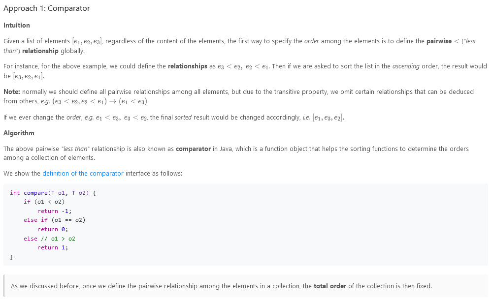
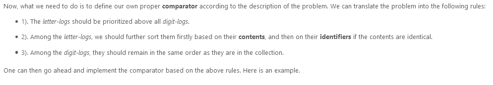
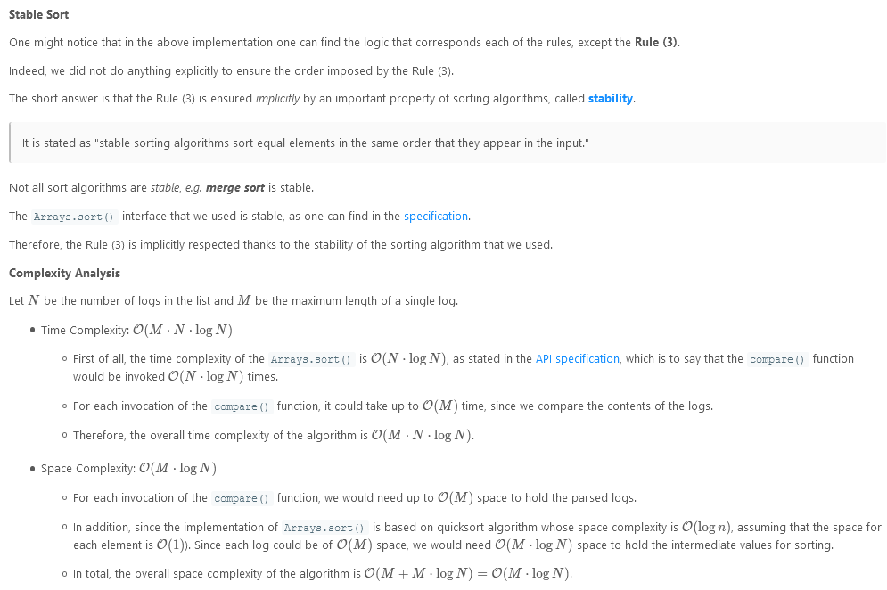
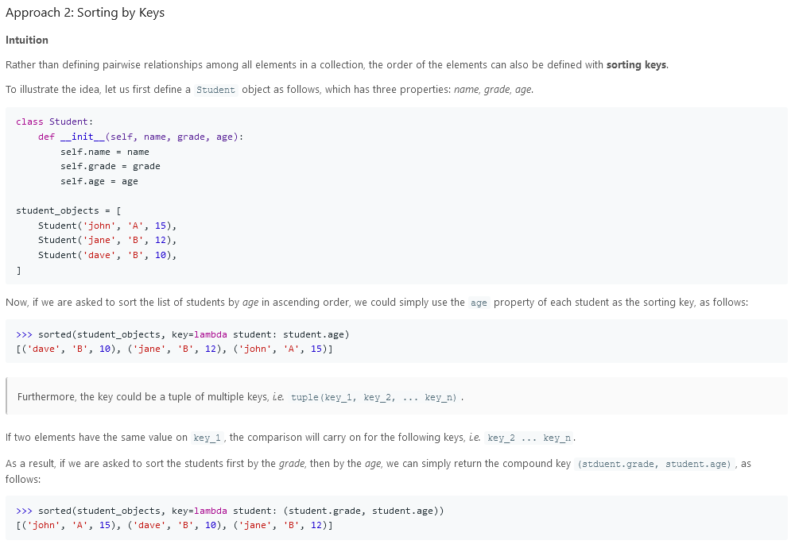
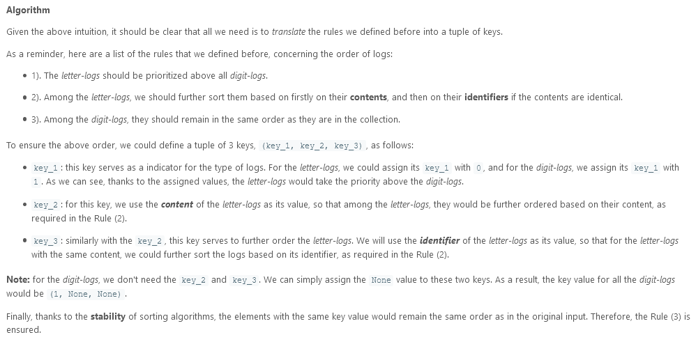
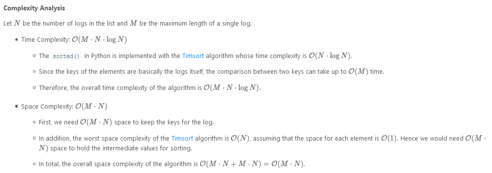

# Reorder Log Files

You have an array of `logs`. Each log is a space delimited string of words.

For each log, the first word in each log is an alphanumeric identifier. Then, either:

- Each word after the identifier will consist only of lowercase letters, or;
- Each word after the identifier will consist only of digits.

We will call these two varieties of logs letter-logs and digit-logs. It is guaranteed that each log has at least one word after its identifier.

Reorder the logs so that all of the letter-logs come before any digit-log. The letter-logs are ordered lexicographically ignoring identifier, with the identifier used in case of ties. The digit-logs should be put in their original order.

Return the final order of the logs.

### Example 1:

```
Input: logs = ["dig1 8 1 5 1","let1 art can","dig2 3 6","let2 own kit dig","let3 art zero"]
Output: ["let1 art can","let3 art zero","let2 own kit dig","dig1 8 1 5 1","dig2 3 6"]
```

### Constraints:

- `0 <= logs.length <= 100`
- `3 <= logs[i].length <= 100`
- `logs[i]` is guaranteed to have an identifier, and a word after the identifier.

---




**Implement**

```
class Solution {
    public String[] reorderLogFiles(String[] logs) {

        Comparator<String> myComp = new Comparator<String>() {
            @Override
            public int compare(String log1, String log2) {
                // split each log into two parts: <identifier, content>
                String[] split1 = log1.split(" ", 2);
                String[] split2 = log2.split(" ", 2);

                boolean isDigit1 = Character.isDigit(split1[1].charAt(0));
                boolean isDigit2 = Character.isDigit(split2[1].charAt(0));

                // case 1). both logs are letter-logs
                if (!isDigit1 && !isDigit2) {
                    // first compare the content
                    int cmp = split1[1].compareTo(split2[1]);
                    if (cmp != 0)
                        return cmp;
                    // logs of same content, compare the identifiers
                    return split1[0].compareTo(split2[0]);
                }

                // case 2). one of logs is digit-log
                if (!isDigit1 && isDigit2)
                    // the letter-log comes before digit-logs
                    return -1;
                else if (isDigit1 && !isDigit2)
                    return 1;
                else
                    // case 3). both logs are digit-log
                    return 0;
            }
        };

        Arrays.sort(logs, myComp);
        return logs;
    }
}
```



---




**Implement**

```
class Solution:
    def reorderLogFiles(self, logs: List[str]) -> List[str]:

        def get_key(log):
            _id, rest = log.split(" ", maxsplit=1)
            return (0, rest, _id) if rest[0].isalpha() else (1, )

        return sorted(logs, key=get_key)
```



---

### Solution:

```
/**
 * @param {string[]} logs
 * @return {string[]}
 */
var reorderLogFiles = function(logs) {
    return logs.sort(function(log1, log2){
        const split1 = log1.split(" ");
        const split2 = log2.split(" ");
        const identifier1 = split1.shift();
        const identifier2 = split2.shift();
        const contents1 = split1.join(' ');
        const contents2 = split2.join(' ');
        const isDigit1 = split1[0].charAt(0);
        const isDigit2 = split2[0].charAt(0);
        if(!/\d+/.test(isDigit1) && !/\d+/.test(isDigit2)){
            const cmp = contents1.localeCompare(contents2);
            if(cmp !== 0) return cmp;
            else {
                return identifier1[0].localeCompare(identifier2[0]);
            }
        }
        if(!/\d+/.test(isDigit1) && /\d+/.test(isDigit2)){
            return -1;
        }else if(/\d+/.test(isDigit1) && !/\d+/.test(isDigit2)){
            return 1;
        }else return 0;
    });
};
```
