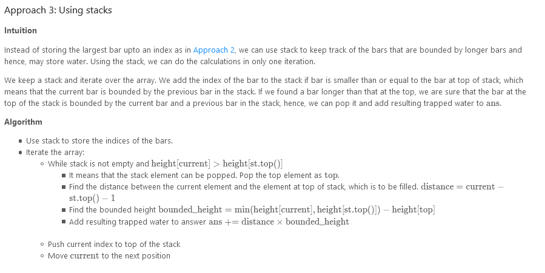

# Trapping Rain Water

Given `n` non-negative integers representing an elevation map where the width of each bar is `1`, compute how much water it can trap after raining.

### Example 1:


```
Input: height = [0,1,0,2,1,0,1,3,2,1,2,1]
Output: 6
Explanation: The above elevation map (black section) is represented by array [0,1,0,2,1,0,1,3,2,1,2,1]. In this case, 6 units of rain water (blue section) are being trapped.
```

### Example 2:

```
Input: height = [4,2,0,3,2,5]
Output: 9
```

### Constraints:

- `n == height.length`
- `0 <= n <= 3 * 104`
- `0 <= height[i] <= 105`

---


---


---




---


---

### Solution:

```
/**
 * @param {number[]} height
 * @return {number}
 */
var trap = function(height) {
    let left = 0, right = height.length -1;
    let left_max = height[left], right_max = height[right];
    let res = 0;
    while (left < right){
        if(height[left] < height[right]){
            if(left_max <= height[left]){
                left_max = height[left];
            } else {
                res += left_max - height[left];
            }
            left++;
        } else {
            if(right_max <= height[right]){
                right_max = height[right];
            } else {
                res += right_max - height[right];
            }
            right--;
        }
    }
    return res;
};
```
