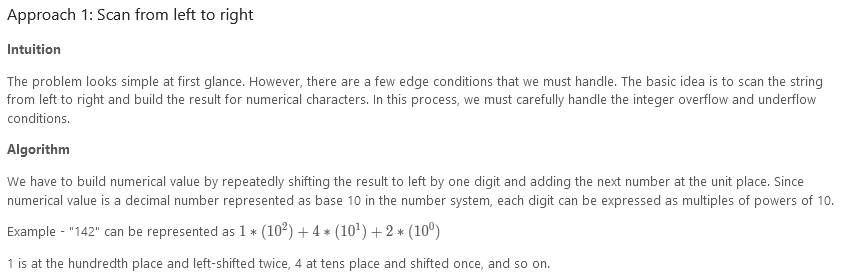
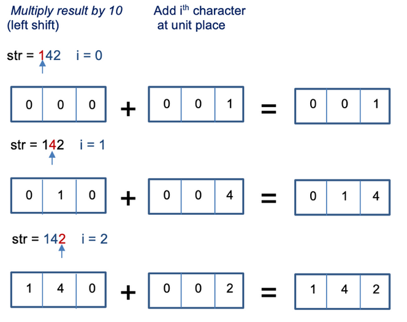
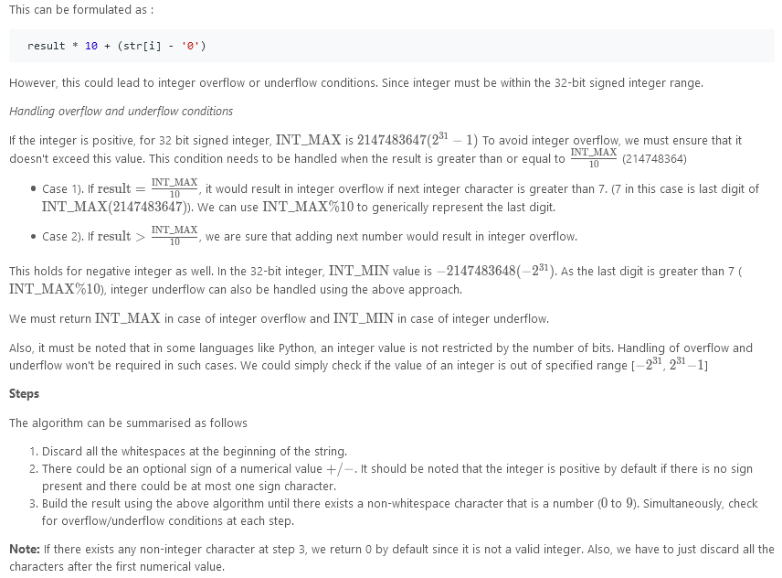
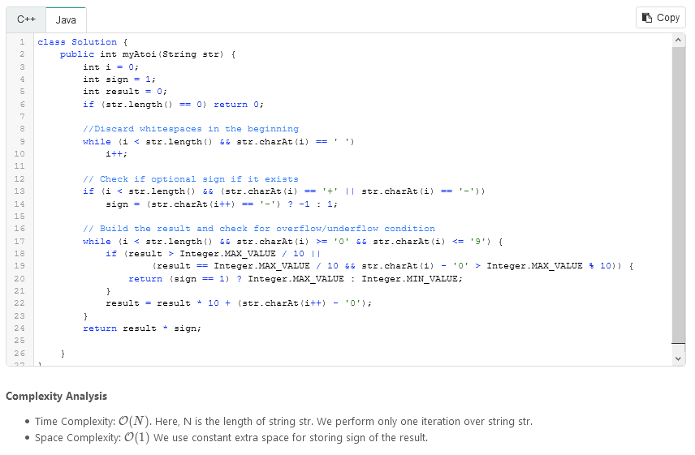

# String to Integer (atoi)

Implement `atoi` which converts a string to an integer.

The function first discards as many whitespace characters as necessary until the first non-whitespace character is found. Then, starting from this character takes an optional initial plus or minus sign followed by as many numerical digits as possible, and interprets them as a numerical value.

The string can contain additional characters after those that form the integral number, which are ignored and have no effect on the behavior of this function.

If the first sequence of non-whitespace characters in str is not a valid integral number, or if no such sequence exists because either str is empty or it contains only whitespace characters, no conversion is performed.

If no valid conversion could be performed, a zero value is returned.

**Note:**

- Only the space character `' '` is considered a whitespace character.
- Assume we are dealing with an environment that could only store integers within the 32-bit signed integer range: [−231, 231 − 1]. If the numerical value is out of the range of representable values, INT_MAX (231 − 1) or INT_MIN (−231) is returned.

### Example 1:

```
Input: str = "42"
Output: 42
```

### Example 2:

```
Input: str = "   -42"
Output: -42
Explanation: The first non-whitespace character is '-', which is the minus sign. Then take as many numerical digits as possible, which gets 42.
```

### Example 3:

```
Input: str = "4193 with words"
Output: 4193
Explanation: Conversion stops at digit '3' as the next character is not a numerical digit.
```

### Example 4:

```
Input: str = "words and 987"
Output: 0
Explanation: The first non-whitespace character is 'w', which is not a numerical digit or a +/- sign. Therefore no valid conversion could be performed.
```

### Example 5:

```
Input: str = "-91283472332"
Output: -2147483648
Explanation: The number "-91283472332" is out of the range of a 32-bit signed integer. Thefore INT_MIN (−231) is returned.
```

### Constraints:

- `0 <= s.length <= 200`
- `s` consists of English letters (lower-case and upper-case), digits, `' '`, `'+'`, `'-'` and `'.'`.

---

### Solution:






---

```
/**
 * @param {string} s
 * @return {number}
 */
var myAtoi = function(s) {
    let numb = 0;
    let start = true;
    let sign = 1;
    for(let i in s){

        if((s[i] == ' ' || s[i] == '-' || s[i] == '+') && start){
            // Skip whitespace
            if(s[i] !== ' ') start = false;
            if(s[i] == '-') sign = -1;
        } else {
            start = false;
            if(s[i] >= '0' && s[i] <= '9'){
              numb = numb * 10 + (s[i] - '0');
              if(numb >= Math.pow(2,31)) return sign > 0 ? (Math.pow(2,31)-1)*sign : (Math.pow(2,31))*sign;
            } else return numb*sign;
        }
    }
    return numb*sign;
};
```
