# Container With Most Water

Given n non-negative integers `a1, a2, ..., an` , where each represents a point at coordinate `(i, ai)`. `n` vertical lines are drawn such that the two endpoints of the line `i` is at `(i, ai)` and `(i, 0)`. Find two lines, which, together with the x-axis forms a container, such that the container contains the most water.

Notice that you may not slant the container.

### Example 1:


```
Input: height = [1,8,6,2,5,4,8,3,7]
Output: 49
Explanation: The above vertical lines are represented by array [1,8,6,2,5,4,8,3,7]. In this case, the max area of water (blue section) the container can contain is 49.
```

### Example 2:

```
Input: height = [1,1]
Output: 1
```

### Example 3:

```
Input: height = [4,3,2,1,4]
Output: 16
```

### Example 4:

```
Input: height = [1,2,1]
Output: 2
```

### Constraints:

- `2 <= height.length <= 3 \* 104`
- `0 <= height[i] <= 3 \* 104`

---

### Solution:

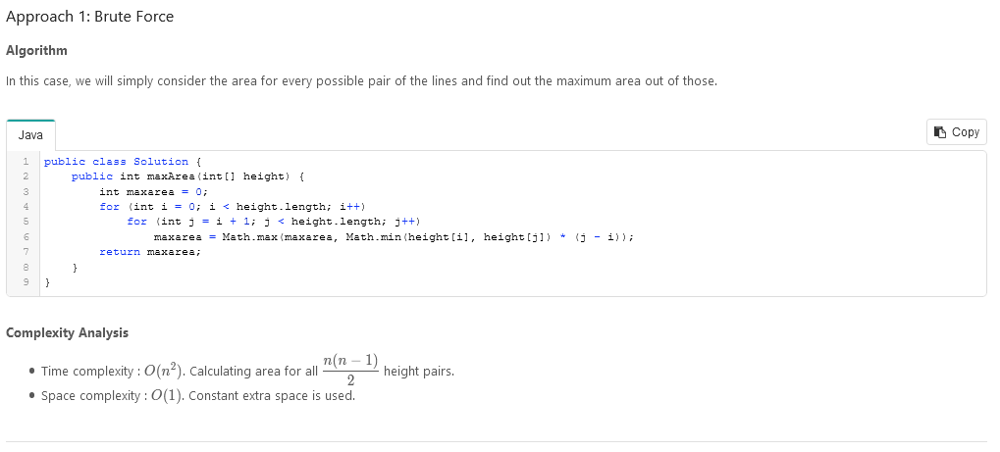

---

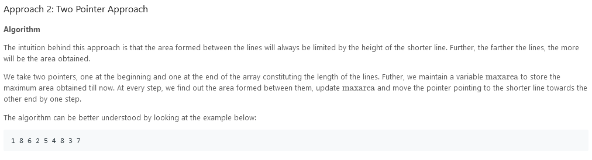
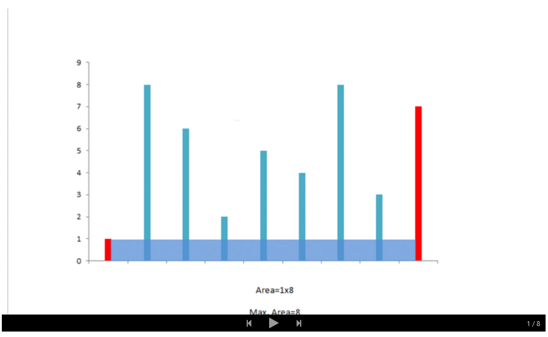
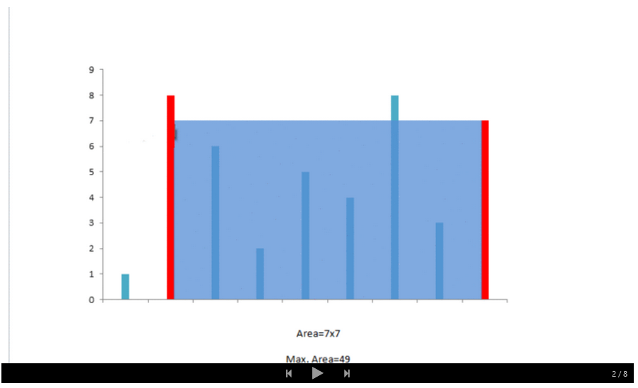
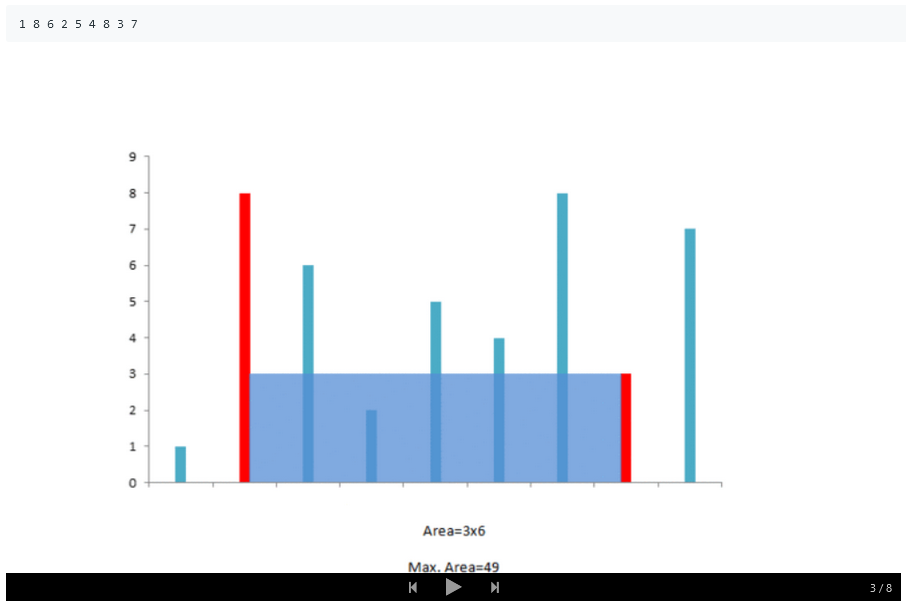
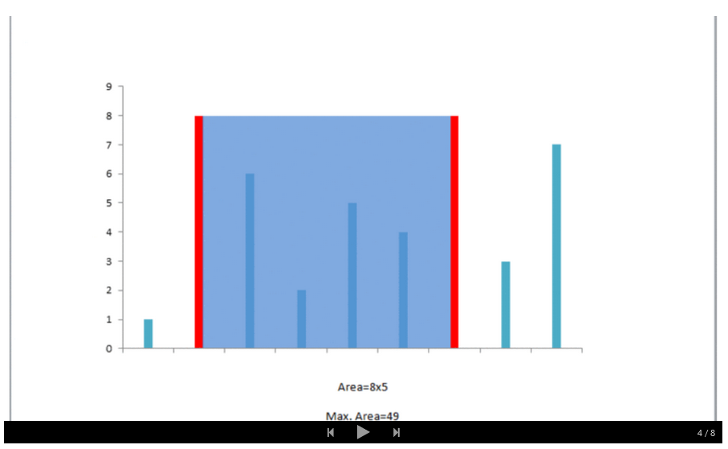
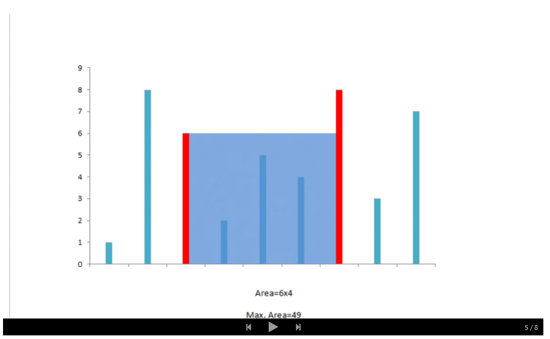
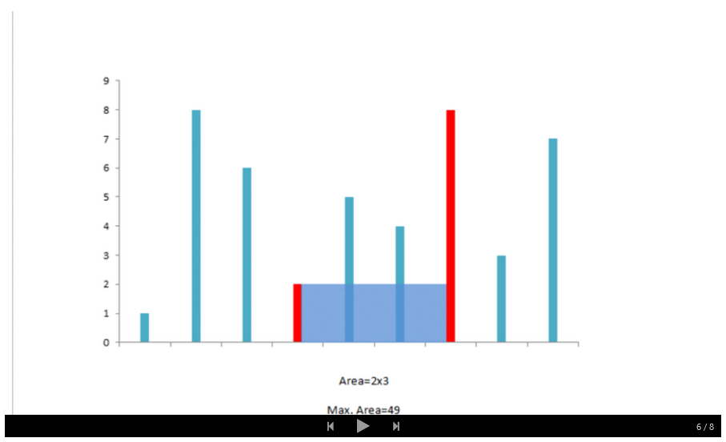
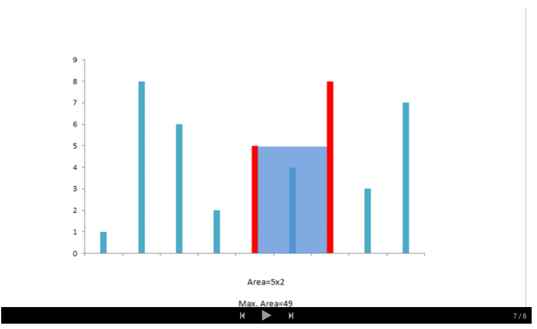
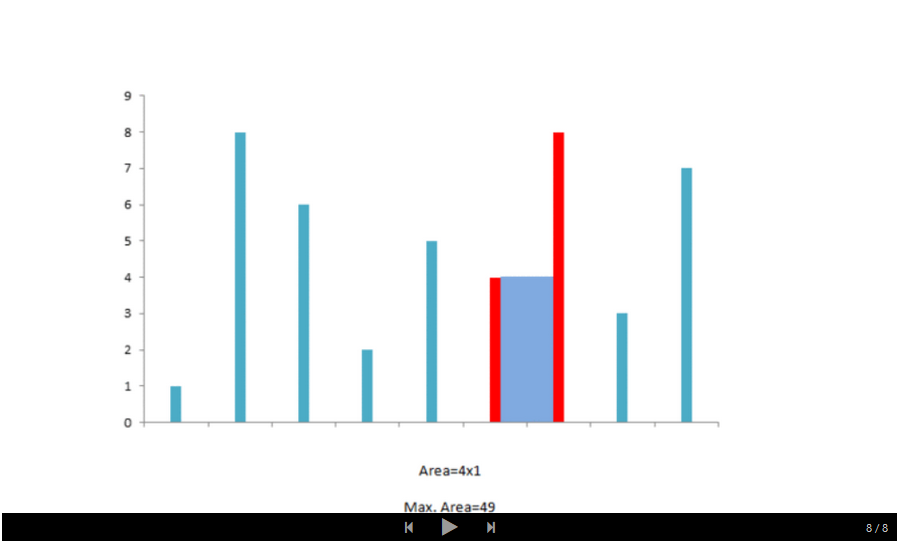
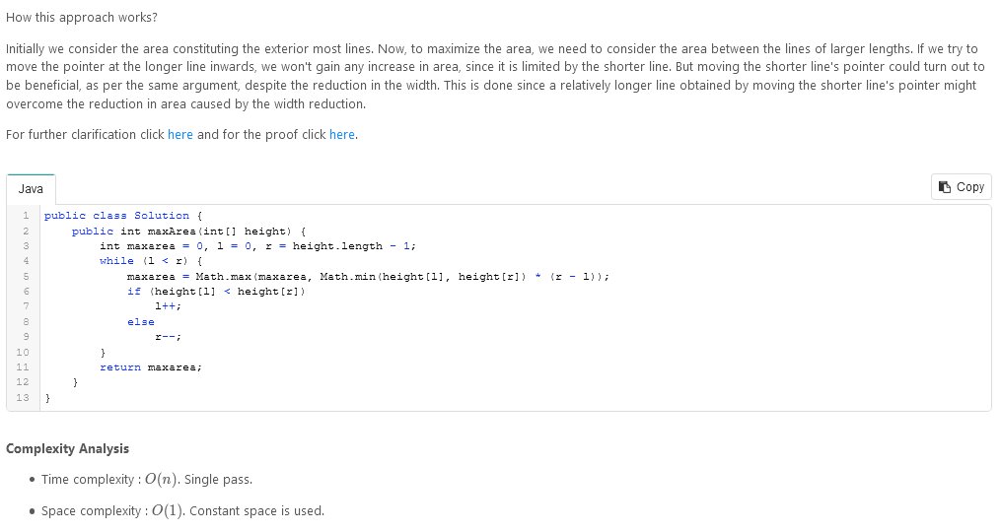

---

```
/**
 * @param {number[]} height
 * @return {number}
 */
var maxArea = function(height) {

};
```
