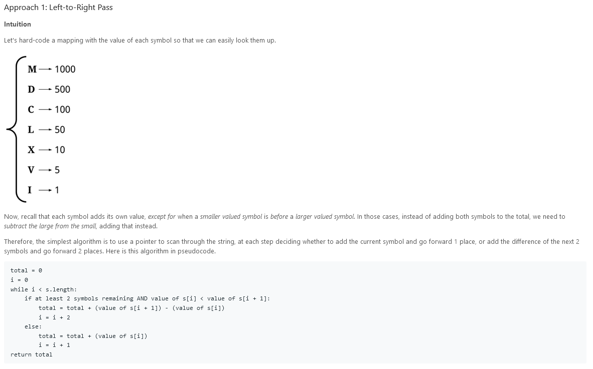
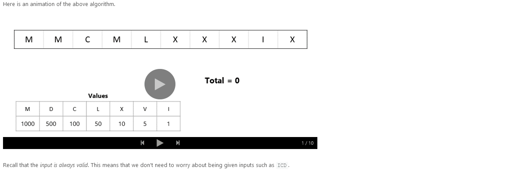
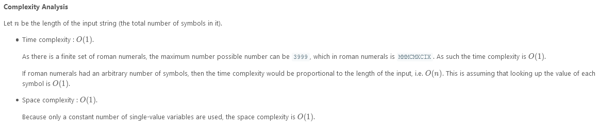
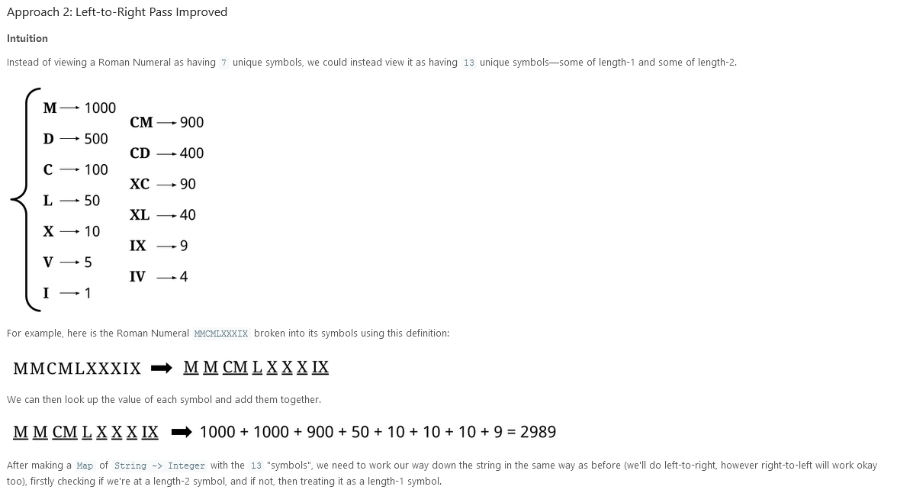
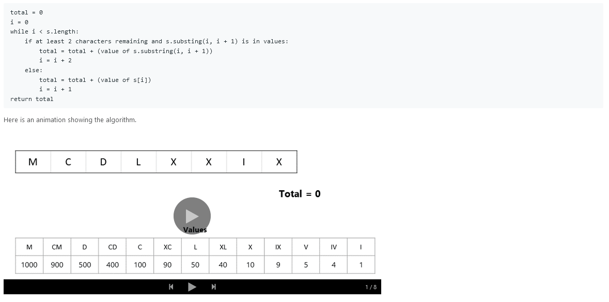
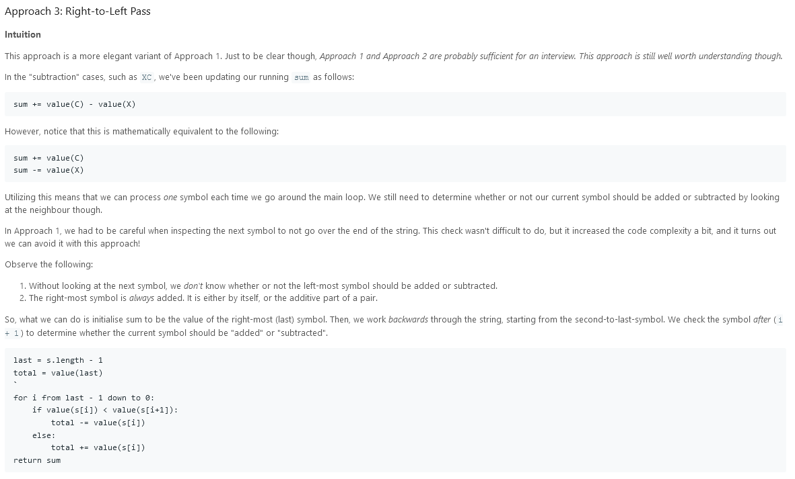
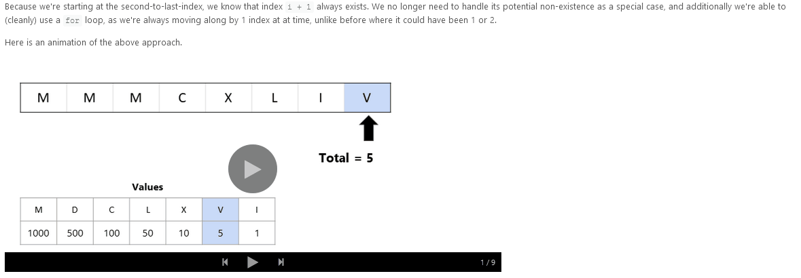

# Roman to Integer

Roman numerals are represented by seven different symbols: `I`, `V`, `X`, `L`, `C`, `D` and `M`.

```
Symbol       Value
I             1
V             5
X             10
L             50
C             100
D             500
M             1000
```

For example, `2` is written as `II` in Roman numeral, just two one's added together. `12` is written as `XII`, which is simply `X + II`. The number `27` is written as `XXVII`, which is `XX + V + II`.

Roman numerals are usually written largest to smallest from left to right. However, the numeral for four is not `IIII`. Instead, the number four is written as `IV`. Because the one is before the five we subtract it making four. The same principle applies to the number nine, which is written as `IX`. There are six instances where subtraction is used:

- `I` can be placed before `V` (5) and `X` (10) to make 4 and 9.
- `X` can be placed before `L` (50) and `C` (100) to make 40 and 90.
- `C` can be placed before `D` (500) and `M` (1000) to make 400 and 900.

Given a roman numeral, convert it to an integer.

### Example 1:

```
Input: s = "III"
Output: 3
```

### Example 2:

```
Input: s = "IV"
Output: 4
```

### Example 3:

```
Input: s = "IX"
Output: 9
```

### Example 4:

```
Input: s = "LVIII"
Output: 58
Explanation: L = 50, V= 5, III = 3.
```

### Example 5:

```
Input: s = "MCMXCIV"
Output: 1994
Explanation: M = 1000, CM = 900, XC = 90 and IV = 4.
```

### Constraints:

- `1 <= s.length <= 15`
- `s` contains only the characters `('I', 'V', 'X', 'L', 'C', 'D', 'M')`.
- It is **guaranteed** that `s` is a valid roman numeral in the range `[1, 3999]`.

---

### Solution:




**Algorithm**

```
class Solution {

    static Map<String, Integer> values = new HashMap<>();

    static {
        values.put("M", 1000);
        values.put("D", 500);
        values.put("C", 100);
        values.put("L", 50);
        values.put("X", 10);
        values.put("V", 5);
        values.put("I", 1);
    }

    public int romanToInt(String s) {

        int sum = 0;
        int i = 0;
        while (i < s.length()) {
            String currentSymbol = s.substring(i, i + 1);
            int currentValue = values.get(currentSymbol);
            int nextValue = 0;
            if (i + 1 < s.length()) {
                String nextSymbol = s.substring(i + 1, i + 2);
                nextValue = values.get(nextSymbol);
            }

            if (currentValue < nextValue) {
                sum += (nextValue - currentValue);
                i += 2;
            }
            else {
                sum += currentValue;
                i += 1;
            }

        }
        return sum;
    }
}
```



---




**Algorithm**

```
class Solution {

    static Map<String, Integer> values = new HashMap<>();

    static {
        values.put("I", 1);
        values.put("V", 5);
        values.put("X", 10);
        values.put("L", 50);
        values.put("C", 100);
        values.put("D", 500);
        values.put("M", 1000);
        values.put("IV", 4);
        values.put("IX", 9);
        values.put("XL", 40);
        values.put("XC", 90);
        values.put("CD", 400);
        values.put("CM", 900);
    }

    public int romanToInt(String s) {

        int sum = 0;
        int i = 0;
        while (i < s.length()) {
            if (i < s.length() - 1) {
                String doubleSymbol = s.substring(i, i + 2);
                // Check if this is the length-2 symbol case.
                if (values.containsKey(doubleSymbol)) {
                    sum += values.get(doubleSymbol);
                    i += 2;
                    continue;
                }
            }
            // Otherwise, it must be the length-1 symbol case.
            String singleSymbol = s.substring(i, i + 1);
            sum += values.get(singleSymbol);
            i += 1;
        }
        return sum;
    }
}
```


---




**Algorithm**

```
class Solution {

    static Map<String, Integer> values = new HashMap<>();

    static {
        values.put("M", 1000);
        values.put("D", 500);
        values.put("C", 100);
        values.put("L", 50);
        values.put("X", 10);
        values.put("V", 5);
        values.put("I", 1);
    }

    public int romanToInt(String s) {

        String lastSymbol = s.substring(s.length() - 1);
        int lastValue = values.get(lastSymbol);
        int total = lastValue;

        for (int i = s.length() - 2; i >= 0; i--) {
            String currentSymbol = s.substring(i, i + 1);
            int currentValue = values.get(currentSymbol);
            if (currentValue < lastValue) {
                total -= currentValue;
            } else {
                total += currentValue;
            }
            lastValue = currentValue;
        }
        return total;
    }
}
```


---

```
/**
 * @param {string} s
 * @return {number}
 */
var romanToInt = function(s) {

};
```
