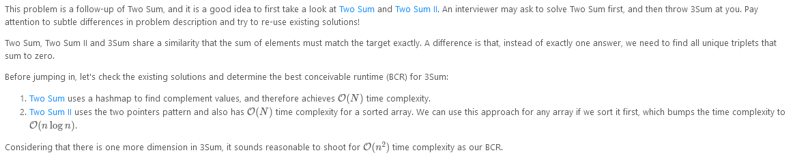
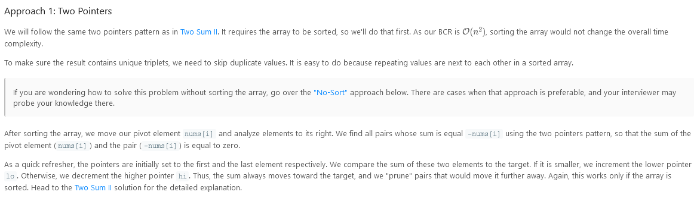
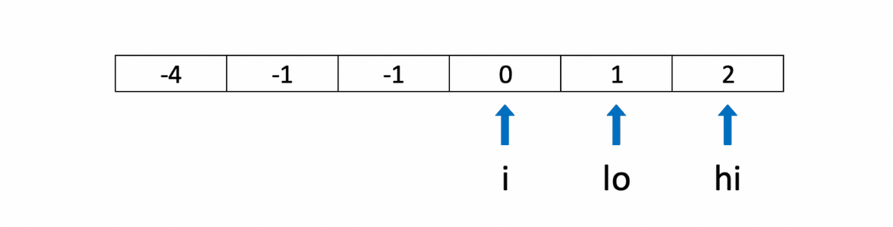
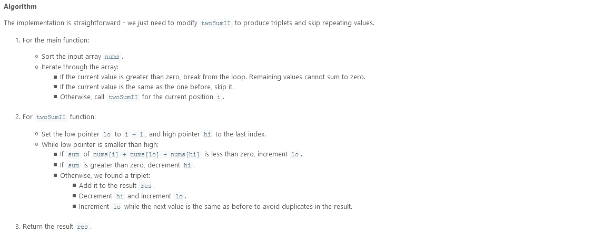
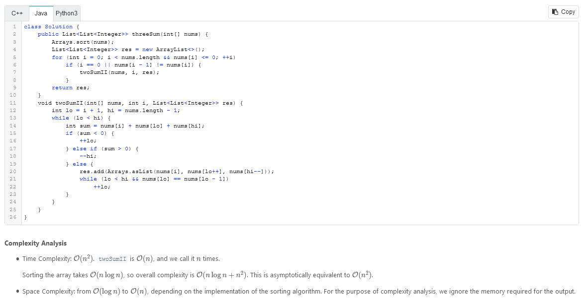
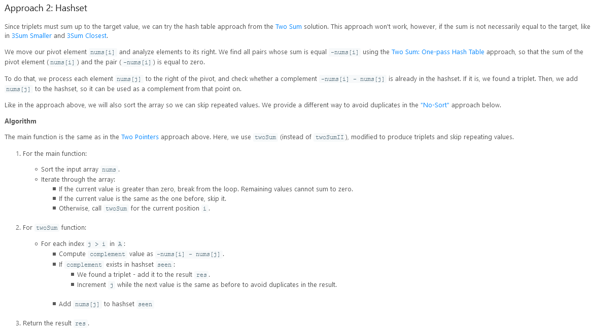
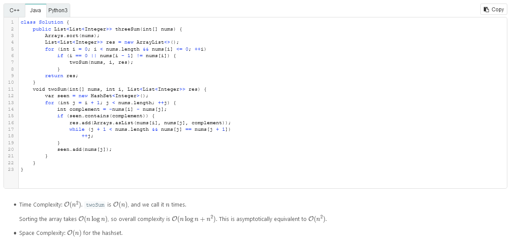
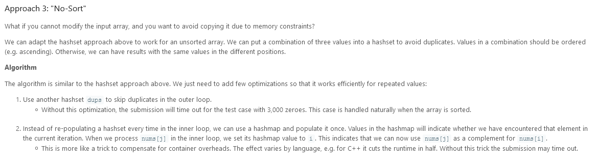
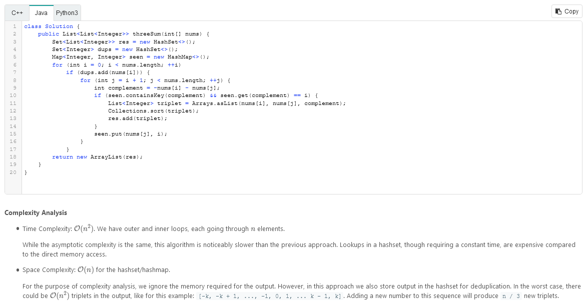

# 3Sum

Given an array `nums` of n integers, are there elements a, b, c in `nums` such that a + b + c = 0? Find all unique triplets in the array which gives the sum of zero.

Notice that you may not slant the container.

### Example 1:

```
Input: nums = [-1,0,1,2,-1,-4]
Output: [[-1,-1,2],[-1,0,1]]
```

### Example 2:

```
Input: nums = []
Output: []
```

### Example 3:

```
Input: nums = [0]
Output: []
```

### Constraints:

- `0 <= nums.length <= 3000`
- `-105 <= nums[i] <= 105`

---

### Solution:



---






---




---




---

```
/**
 * @param {number[]} nums
 * @return {number[][]}
 */
var threeSum = function(nums) {

};
```
