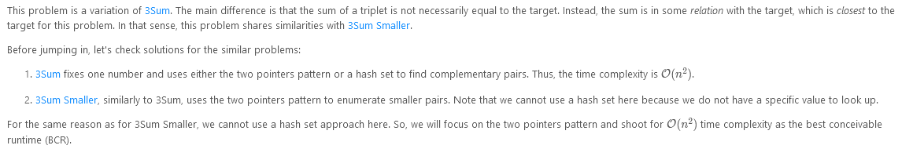
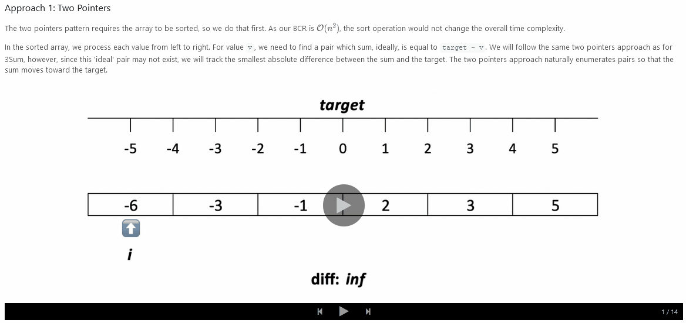
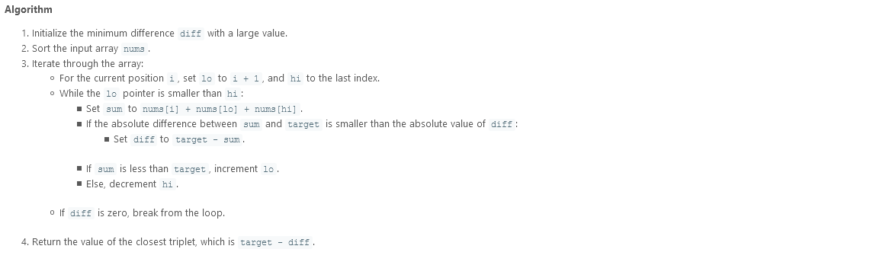
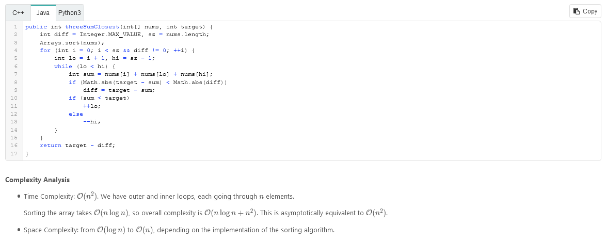
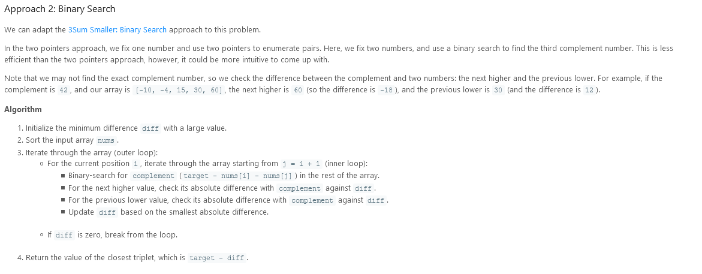
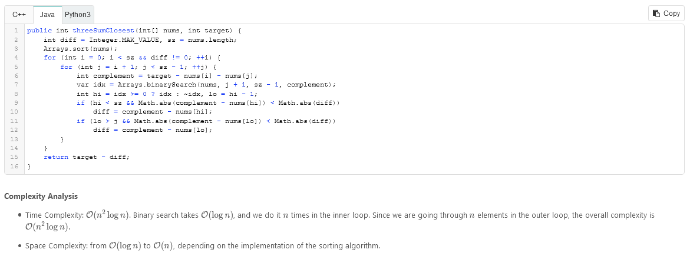

# 3Sum Closest

Given an array `nums` of n integers and an integer `target`, find three integers in `nums` such that the sum is closest to `target`. Return the sum of the three integers. You may assume that each input would have exactly one solution.

### Example 1:

```
Input: nums = [-1,2,1,-4], target = 1
Output: 2
Explanation: The sum that is closest to the target is 2. (-1 + 2 + 1 = 2).
```

### Constraints:

- `3 <= nums.length <= 10^3`
- `-10^3 <= nums[i] <= 10^3`
- `-10^4 <= target <= 10^4`

---

### Solution:



---





---




---

```
/**
 * @param {number[]} nums
 * @param {number} target
 * @return {number}
 */
var threeSumClosest = function(nums, target) {

};
```
