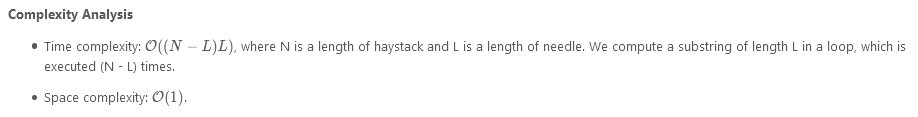
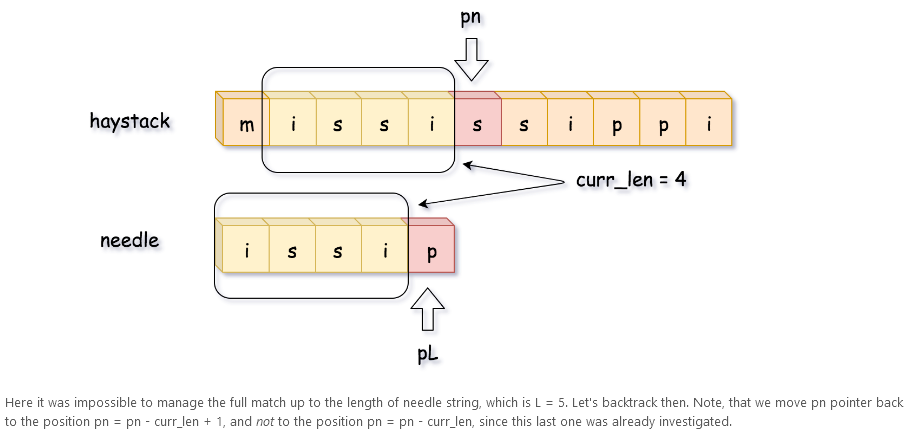

# Implement strStr()

Implement `strStr()`.

Return the index of the first occurrence of needle in haystack, or `-1` if `needle` is not part of `haystack`.

**Clarification:**

What should we return when `needle` is an empty string? This is a great question to ask during an interview.

For the purpose of this problem, we will return 0 when `needle` is an empty string. This is consistent to C's `strstr()` and Java's `indexOf()`.

### Example 1:

```
Input: haystack = "hello", needle = "ll"
Output: 2
```

### Example 2:

```
Input: haystack = "aaaaa", needle = "bba"
Output: -1
```

### Example 3:

```
Input: haystack = "", needle = ""
Output: 0
```

### Constraints:

- `0 <= haystack.length, needle.length <= 5 * 104`
- `haystack` and `needle` consist of only lower-case English characters.

---

### Solution:


---




---





**Implementation**

```
class Solution {
  public int strStr(String haystack, String needle) {
    int L = needle.length(), n = haystack.length();
    if (L == 0) return 0;

    int pn = 0;
    while (pn < n - L + 1) {
      // find the position of the first needle character
      // in the haystack string
      while (pn < n - L + 1 && haystack.charAt(pn) != needle.charAt(0)) ++pn;

      // compute the max match string
      int currLen = 0, pL = 0;
      while (pL < L && pn < n && haystack.charAt(pn) == needle.charAt(pL)) {
        ++pn;
        ++pL;
        ++currLen;
      }

      // if the whole needle string is found,
      // return its start position
      if (currLen == L) return pn - L;

      // otherwise, backtrack
      pn = pn - currLen + 1;
    }
    return -1;
  }
}
```

---


**Implementation**

```
class Solution {
  // function to convert character to integer
  public int charToInt(int idx, String s) {
    return (int)s.charAt(idx) - (int)'a';
  }

  public int strStr(String haystack, String needle) {
    int L = needle.length(), n = haystack.length();
    if (L > n) return -1;

    // base value for the rolling hash function
    int a = 26;
    // modulus value for the rolling hash function to avoid overflow
    long modulus = (long)Math.pow(2, 31);

    // compute the hash of strings haystack[:L], needle[:L]
    long h = 0, ref_h = 0;
    for (int i = 0; i < L; ++i) {
      h = (h * a + charToInt(i, haystack)) % modulus;
      ref_h = (ref_h * a + charToInt(i, needle)) % modulus;
    }
    if (h == ref_h) return 0;

    // const value to be used often : a**L % modulus
    long aL = 1;
    for (int i = 1; i <= L; ++i) aL = (aL * a) % modulus;

    for (int start = 1; start < n - L + 1; ++start) {
      // compute rolling hash in O(1) time
      h = (h * a - charToInt(start - 1, haystack) * aL
              + charToInt(start + L - 1, haystack)) % modulus;
      if (h == ref_h) return start;
    }
    return -1;
  }
}
```

**Complexity Analysis**

- Time complexity: O(N), one computes the reference hash of the needle string in O(L) time, and then runs a loop of (N−L) steps with constant time operations in it.

- Space complexity: O(1).

---

```
/**
 * @param {string} haystack
 * @param {string} needle
 * @return {number}
 */
var strStr = function(haystack, needle) {

};
```
