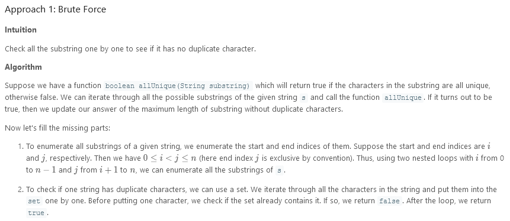
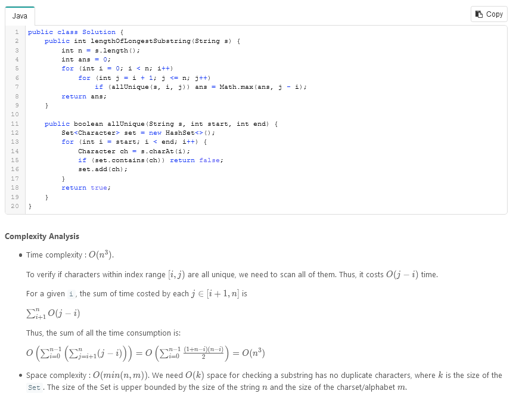
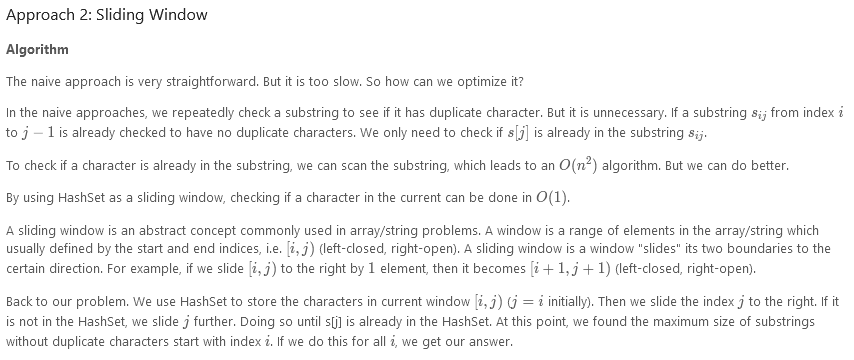
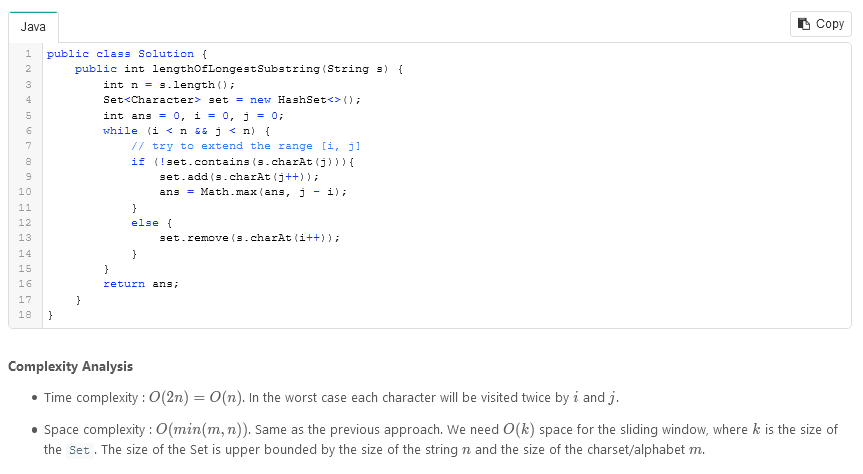
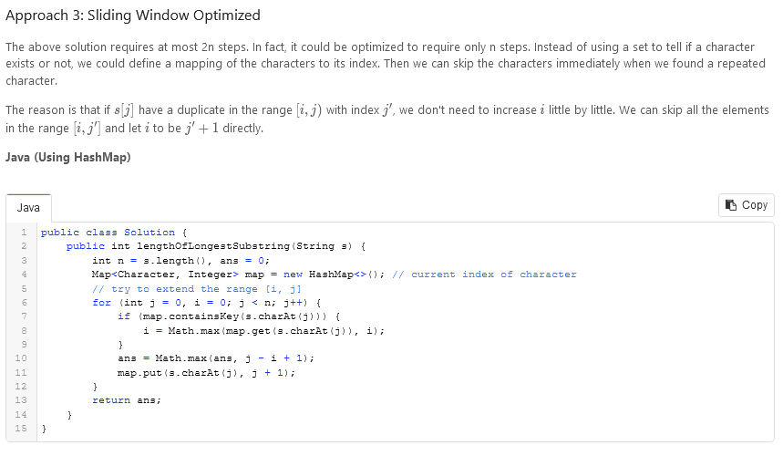
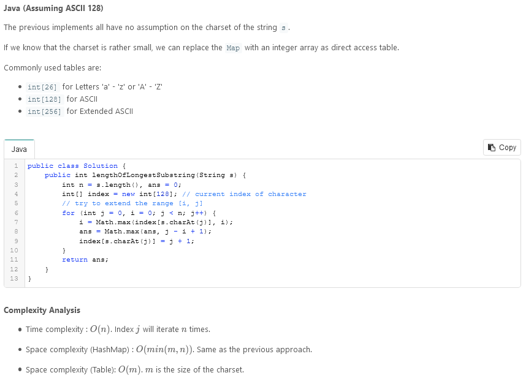

# Longest Substring Without Repeating Characters

Given a string `s`, find the length of the longest substring without repeating characters.

### Example 1:

```
Input: s = "abcabcbb"
Output: 3
Explanation: The answer is "abc", with the length of 3.
```

### Example 2:

```
Input: s = "bbbbb"
Output: 1
Explanation: The answer is "b", with the length of 1.
```

### Example 3:

```
Input: s = "pwwkew"
Output: 3
Explanation: The answer is "wke", with the length of 3.
Notice that the answer must be a substring, "pwke" is a subsequence and not a substring.
```

### Example 4:

```
Input: s = ""
Output: 0
```

### Constraints:

- `0 <= s.length <= 5 * 104`
- `s` consists of English letters, digits, symbols and spaces.

---

### Solution:




---




---




---

```
/**
 * @param {string} s
 * @return {number}
 */
var lengthOfLongestSubstring = function(s) {
    const n = s.length;
    let ans = 0;
    const map = new Map();

    for (let i = 0, j = 0; j < n; j++) {
        if(map.has(s.charAt(j))){
            i = Math.max(map.get(s.charAt(j)) + 1, i);
        }
        ans = Math.max(ans, j - i + 1);
        map.set(s.charAt(j), j);
    }
    return ans;
};
```
