# Reverse Nodes in k-Group

Given a linked list, reverse the nodes of a linked list k at a time and return its modified list.

k is a positive integer and is less than or equal to the length of the linked list. If the number of nodes is not a multiple of k then left-out nodes, in the end, should remain as it is.

Follow up:

- Could you solve the problem in `O(1)` extra memory space?
- You may not alter the values in the list's nodes, only nodes itself may be changed.

### Example 1:


```
Input: head = [1,2,3,4,5], k = 2
Output: [2,1,4,3,5]
```

### Example 2:


```
Input: head = [1,2,3,4,5], k = 3
Output: [3,2,1,4,5]
```

### Example 3:

```
Input: head = [1,2,3,4,5], k = 1
Output: [1,2,3,4,5]
```

### Example 4:

```
Input: head = [1], k = 1
Output: [1]
```

### Constraints:

- The number of nodes in the list is in the range `sz`.
- `1 <= sz <= 5000`
- `0 <= Node.val <= 1000`
- `1 <= k <= sz`

---

### Solution:

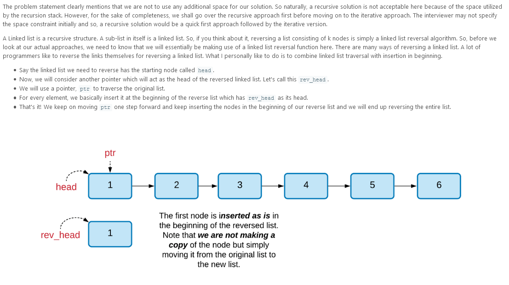
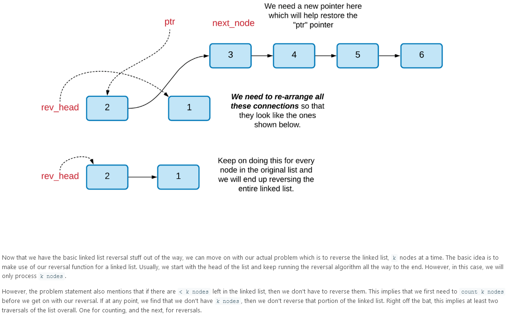

---

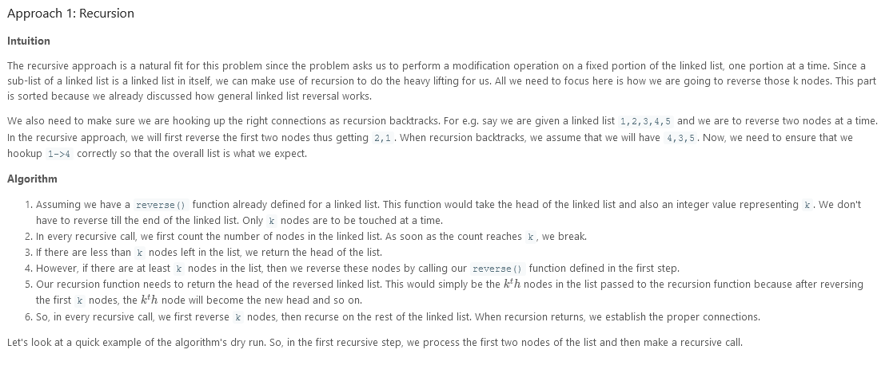
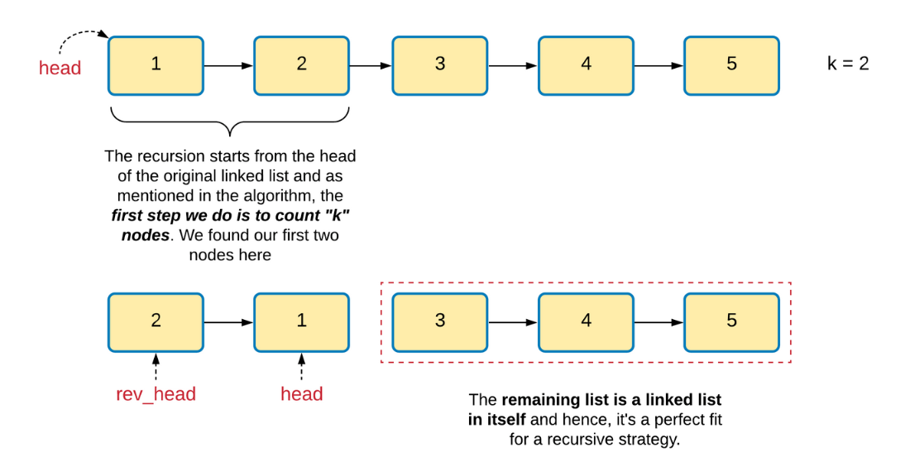
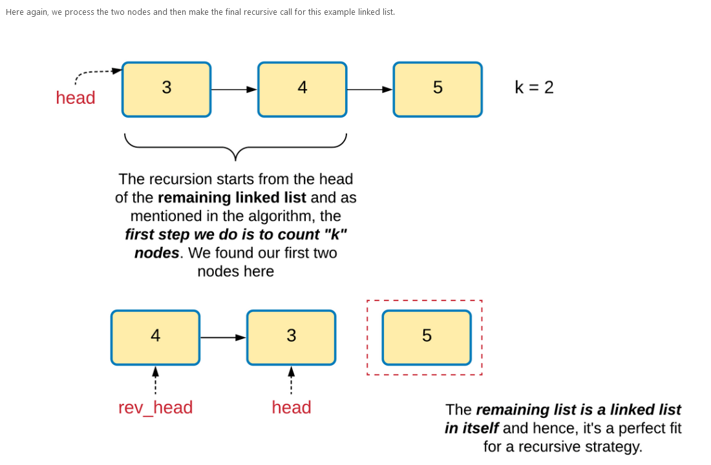
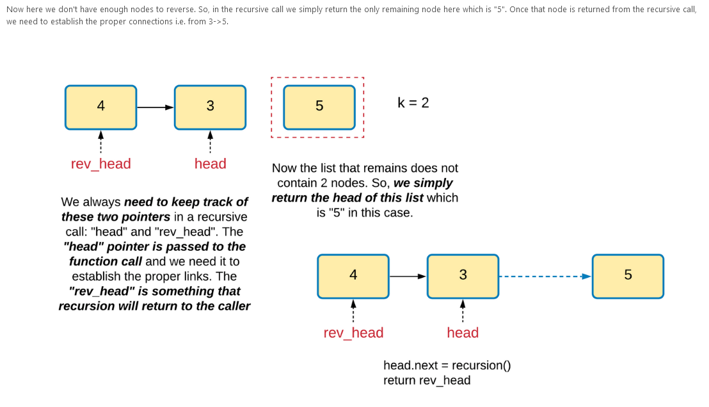
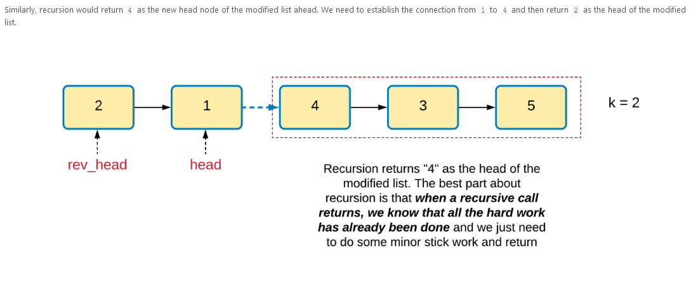

```
/**
 * Definition for singly-linked list.
 * public class ListNode {
 *     int val;
 *     ListNode next;
 *     ListNode(int x) { val = x; }
 * }
 */
class Solution {

    public ListNode reverseLinkedList(ListNode head, int k) {

        // Reverse k nodes of the given linked list.
        // This function assumes that the list contains
        // atleast k nodes.
        ListNode new_head = null;
        ListNode ptr = head;

        while (k > 0) {

            // Keep track of the next node to process in the
            // original list
            ListNode next_node = ptr.next;

            // Insert the node pointed to by "ptr"
            // at the beginning of the reversed list
            ptr.next = new_head;
            new_head = ptr;

            // Move on to the next node
            ptr = next_node;

            // Decrement the count of nodes to be reversed by 1
            k--;
        }


        // Return the head of the reversed list
        return new_head;

    }

    public ListNode reverseKGroup(ListNode head, int k) {

        int count = 0;
        ListNode ptr = head;

        // First, see if there are atleast k nodes
        // left in the linked list.
        while (count < k && ptr != null) {
            ptr = ptr.next;
            count++;
        }


        // If we have k nodes, then we reverse them
        if (count == k) {

            // Reverse the first k nodes of the list and
            // get the reversed list's head.
            ListNode reversedHead = this.reverseLinkedList(head, k);

            // Now recurse on the remaining linked list. Since
            // our recursion returns the head of the overall processed
            // list, we use that and the "original" head of the "k" nodes
            // to re-wire the connections.
            head.next = this.reverseKGroup(ptr, k);
            return reversedHead;
        }

        return head;
    }
}
```

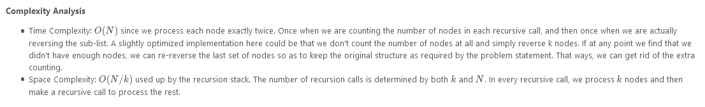

---

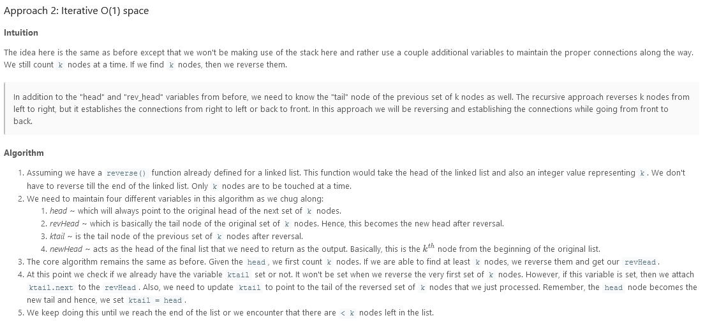
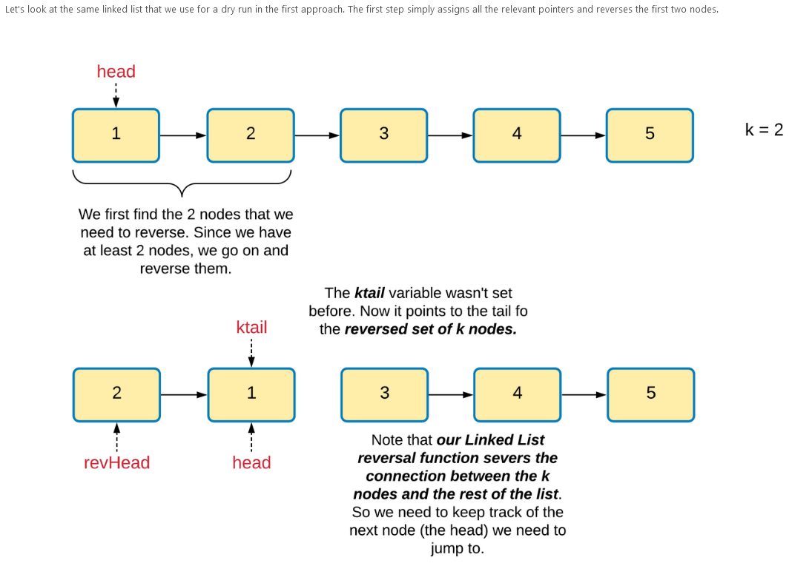
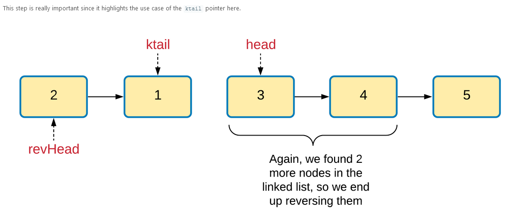
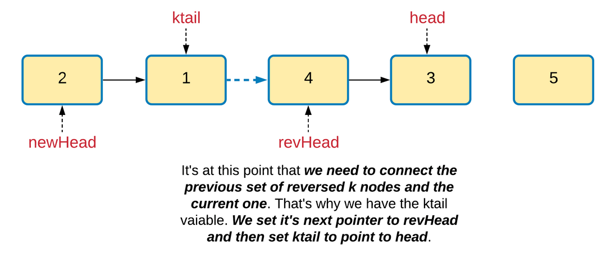

```
class Solution {

    public ListNode reverseLinkedList(ListNode head, int k) {

        // Reverse k nodes of the given linked list.
        // This function assumes that the list contains
        // atleast k nodes.
        ListNode new_head = null;
        ListNode ptr = head;

        while (k > 0) {

            // Keep track of the next node to process in the
            // original list
            ListNode next_node = ptr.next;

            // Insert the node pointed to by "ptr"
            // at the beginning of the reversed list
            ptr.next = new_head;
            new_head = ptr;

            // Move on to the next node
            ptr = next_node;

            // Decrement the count of nodes to be reversed by 1
            k--;
        }


        // Return the head of the reversed list
        return new_head;

    }

    public ListNode reverseKGroup(ListNode head, int k) {

        ListNode ptr = head;
        ListNode ktail = null;

        // Head of the final, moified linked list
        ListNode new_head = null;

        // Keep going until there are nodes in the list
        while (ptr != null) {

            int count = 0;

            // Start counting nodes from the head
            ptr = head;

            // Find the head of the next k nodes
            while (count < k && ptr != null) {
                ptr = ptr.next;
                count += 1;
            }

            // If we counted k nodes, reverse them
            if (count == k) {

                // Reverse k nodes and get the new head
                ListNode revHead = this.reverseLinkedList(head, k);

                // new_head is the head of the final linked list
                if (new_head == null)
                    new_head = revHead;

                // ktail is the tail of the previous block of
                // reversed k nodes
                if (ktail != null)
                    ktail.next = revHead;

                ktail = head;
                head = ptr;
            }
        }

         // attach the final, possibly un-reversed portion
        if (ktail != null)
            ktail.next = head;

        return new_head == null ? head : new_head;
    }
}
```

- Time Complexity: O(N)O(N)O(N) since we process each node exactly twice. Once when we are counting the number of nodes in each recursive call, and then once when we are actually reversing the sub-list.
- Space Complexity: O(1)O(1)O(1).

---

```
/**
 * Definition for singly-linked list.
 * function ListNode(val, next) {
 *     this.val = (val===undefined ? 0 : val)
 *     this.next = (next===undefined ? null : next)
 * }
 */
/**
 * @param {ListNode} head
 * @param {number} k
 * @return {ListNode}
 */
var reverseKGroup = function(head, k) {
    function reverse(head, k) {
        let ptr = head;
        let rev_head = null;
        while(k > 0){
            let next_node = ptr.next;
            ptr.next = rev_head;
            rev_head = ptr;
            ptr = next_node;
            k--;
        }
        return rev_head;
    }
    let ptr = head;
    let count = 0;
    let newHead = null;
    let ktail = null;
    while (count < k && ptr !== null){
        ptr = ptr.next;
        count++;
        if(count == k){
            if(newHead == null){
                newHead = reverse(head, k);
            } else {
                let reverseHead = reverse(head, k);
                ktail.next = reverseHead;
            }
            ktail = head;
            ktail.next = ptr;
            head = ptr;
            count = 0;
        }
    }
    return newHead;
};
```
