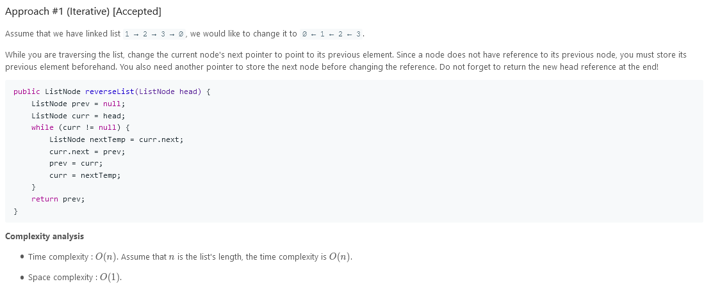
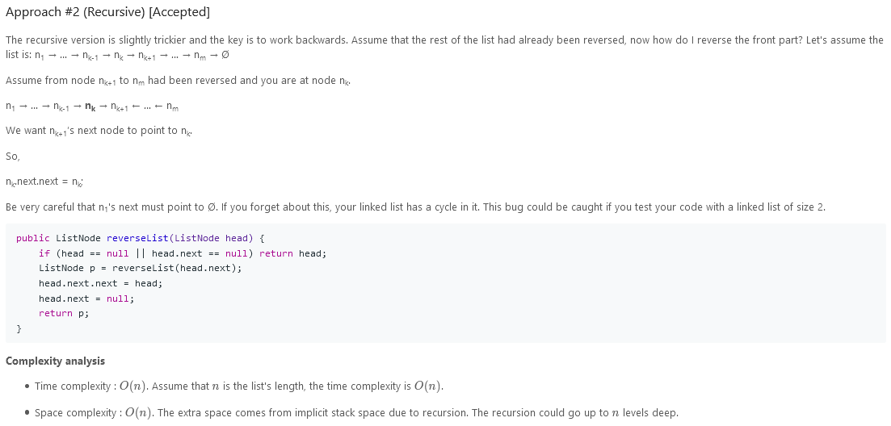

# Reverse Linked List

Reverse a singly linked list.

### Example 1:

```
Input: 1->2->3->4->5->NULL
Output: 5->4->3->2->1->NULL
```

### Follow up:

A linked list can be reversed either iteratively or recursively. Could you implement both?

---

### Solution:



---



---

```
/**
 * Definition for singly-linked list.
 * function ListNode(val, next) {
 *     this.val = (val===undefined ? 0 : val)
 *     this.next = (next===undefined ? null : next)
 * }
 */
/**
 * @param {ListNode} head
 * @return {ListNode}
 */
var reverseList = function(head) {
    let ptr = head;
    let rev_head = null;
    while(ptr !== null){
        let temp = ptr.next;
        ptr.next = rev_head;
        rev_head = ptr;
        ptr = temp;
    }
    return rev_head;
};
```
