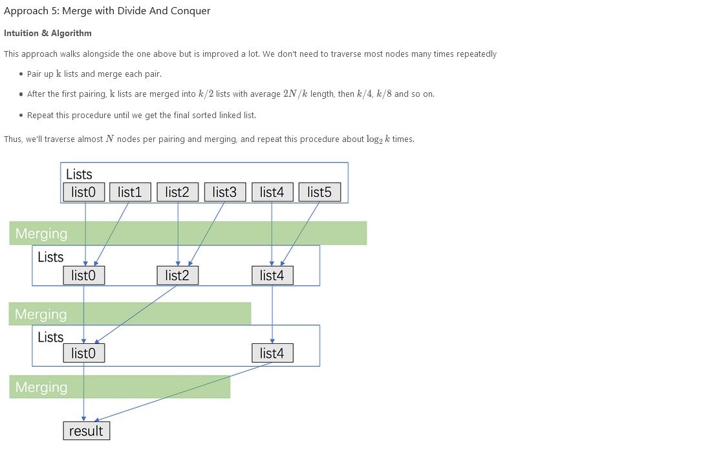

# Merge k Sorted Lists

You are given an array of `k` linked-lists `lists`, each linked-list is sorted in ascending order.

Merge all the linked-lists into one sorted linked-list and return it.

### Example 1:

```
Input: lists = [[1,4,5],[1,3,4],[2,6]]
Output: [1,1,2,3,4,4,5,6]
Explanation: The linked-lists are:
[
  1->4->5,
  1->3->4,
  2->6
]
merging them into one sorted list:
1->1->2->3->4->4->5->6
```

### Example 2:

```
Input: lists = []
Output: []
```

### Example 3:

```
Input: lists = [[]]
Output: []
```

### Constraints:

- `k == lists.length`
- `0 <= k <= 10^4`
- `0 <= lists[i].length <= 500`
- `-10^4 <= lists[i][j] <= 10^4`
- `lists[i]` is sorted in **ascending order**.
- The sum of `lists[i].length` won't exceed `10^4`.

---

### Solution:



```
class Solution(object):
    def mergeKLists(self, lists):
        """
        :type lists: List[ListNode]
        :rtype: ListNode
        """
        amount = len(lists)
        interval = 1
        while interval < amount:
            for i in range(0, amount - interval, interval * 2):
                lists[i] = self.merge2Lists(lists[i], lists[i + interval])
            interval *= 2
        return lists[0] if amount > 0 else None

    def merge2Lists(self, l1, l2):
        head = point = ListNode(0)
        while l1 and l2:
            if l1.val <= l2.val:
                point.next = l1
                l1 = l1.next
            else:
                point.next = l2
                l2 = l1
                l1 = point.next.next
            point = point.next
        if not l1:
            point.next=l2
        else:
            point.next=l1
        return head.next
```


---

```
/**
 * Definition for singly-linked list.
 * function ListNode(val, next) {
 *     this.val = (val===undefined ? 0 : val)
 *     this.next = (next===undefined ? null : next)
 * }
 */
/**
 * @param {ListNode[]} lists
 * @return {ListNode}
 */
var mergeKLists = function(lists) {
    function merge2Lists (l1, l2){
        let headL3 = new ListNode(-1);
        let l3 = headL3;
        while(l1 !== null && l2 !== null){
            if(l1.val <= l2.val){
                l3.next = l1;
                l1 = l1.next;
            } else {
                l3.next = l2;
                l2 = l2.next;
            }
            l3 = l3.next;
        }
        l3.next = (l1 == null) ? l2 : l1;
        return headL3.next;
    }
    if(lists.length == 0) return null;
    while(lists.length > 1){
        let a = lists.shift();
        let b = lists.shift();
        let result = merge2Lists(a, b);
        lists.push(result);
    }
    return lists[0];
};
```
