# Validate Binary Search Tree

Given a binary tree, determine if it is a valid binary search tree (BST).

Assume a BST is defined as follows:

- The left subtree of a node contains only nodes with keys **less than** the node's key.
- The right subtree of a node contains only nodes with keys **greater than** the node's key.
- Both the left and right subtrees must also be binary search trees.

### Example 1:

```
    2
   / \
  1   3

Input: [2,1,3]
Output: true
```

### Example 2:

```
    5
   / \
  1   4
     / \
    3   6

Input: [5,1,4,null,null,3,6]
Output: false
Explanation: The root node's value is 5 but its right child's value is 4.
```

---

### Solution:

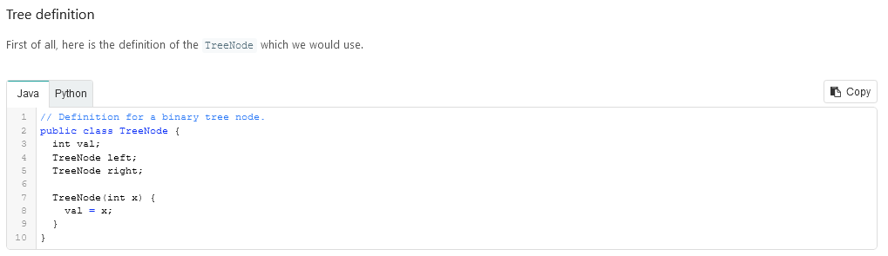

---

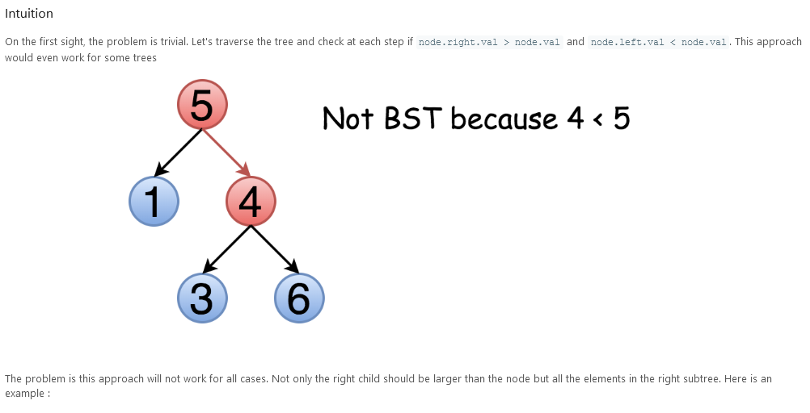
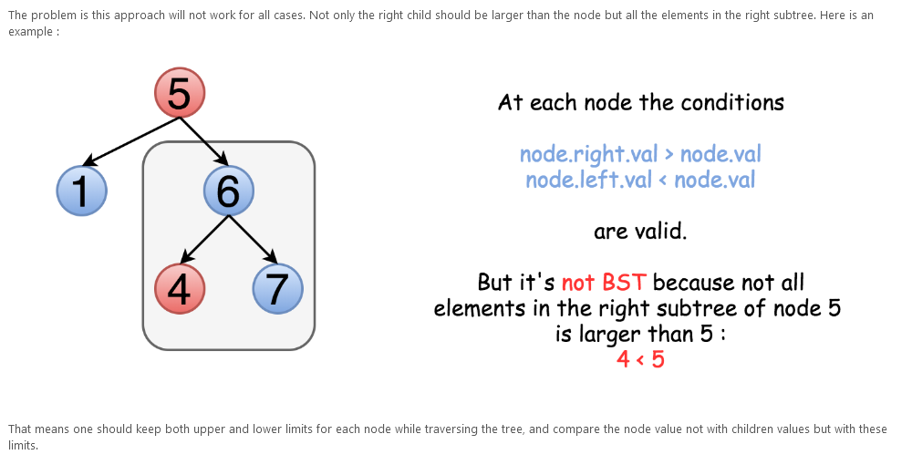

---

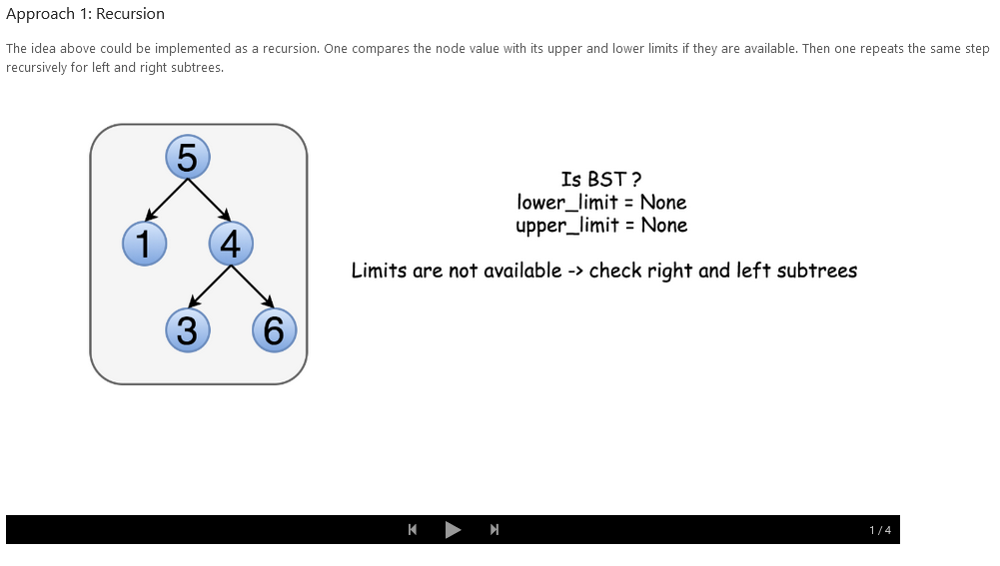
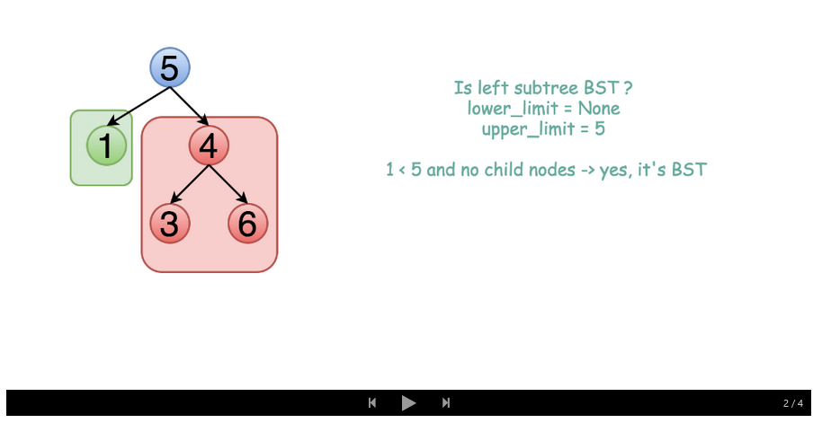
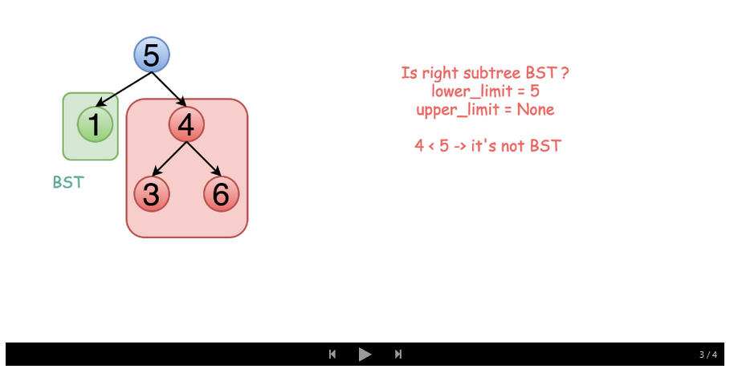
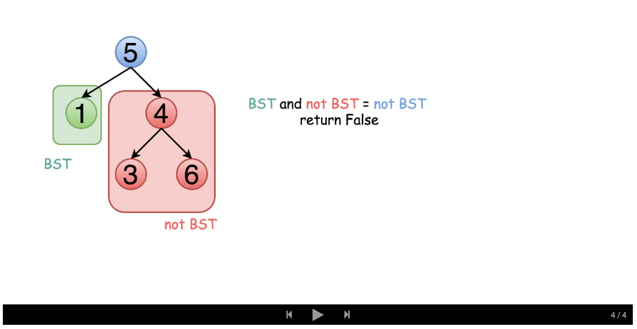
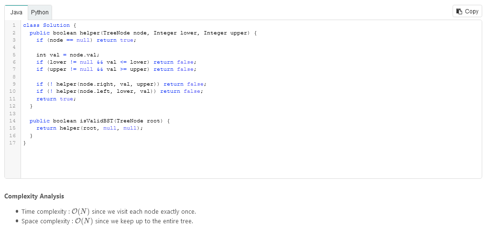

---

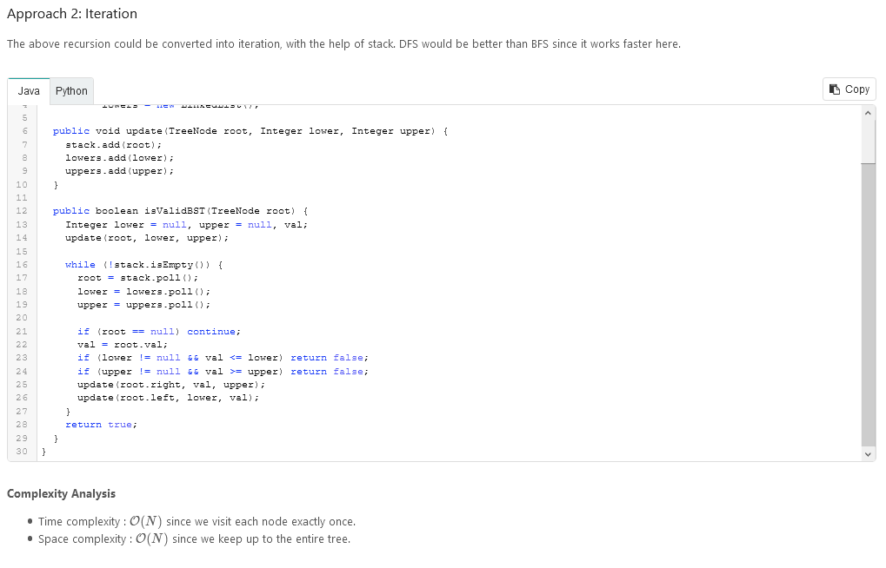

---

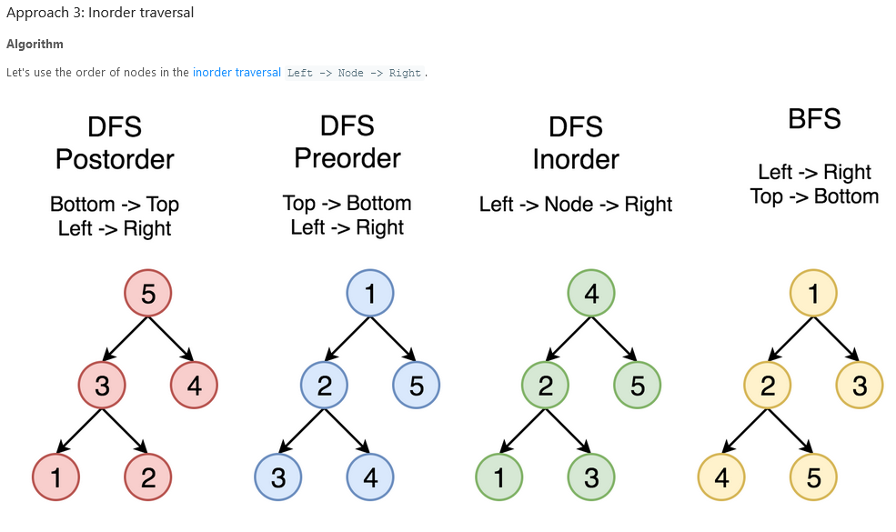
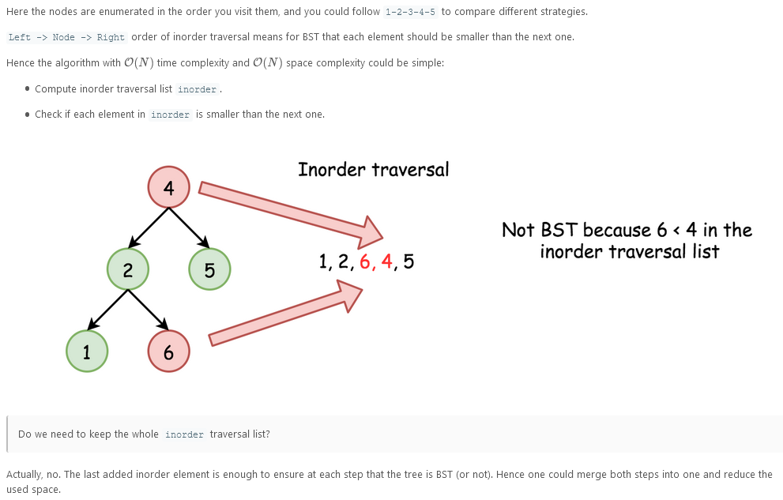
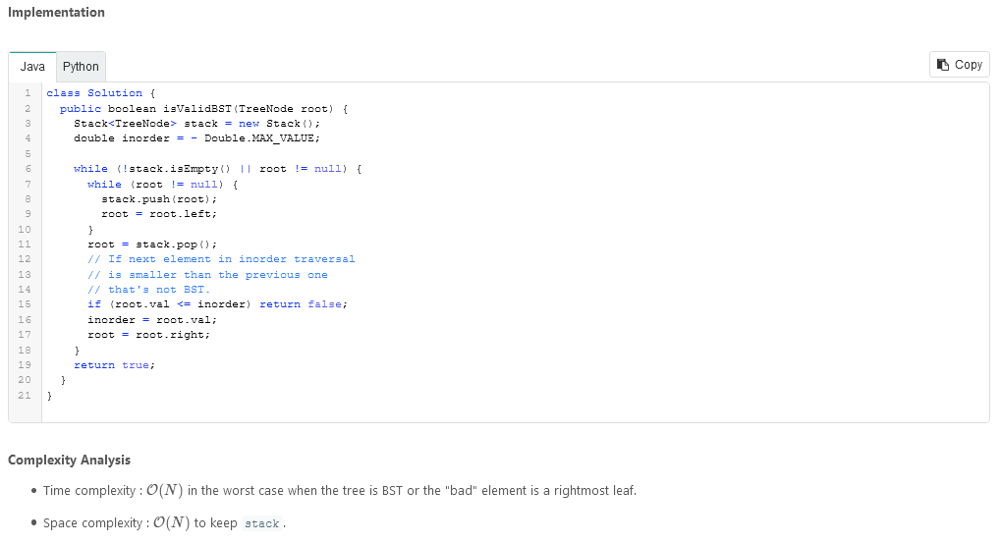

---

```
/**
 * Definition for a binary tree node.
 * function TreeNode(val, left, right) {
 *     this.val = (val===undefined ? 0 : val)
 *     this.left = (left===undefined ? null : left)
 *     this.right = (right===undefined ? null : right)
 * }
 */
/**
 * @param {TreeNode} root
 * @return {boolean}
 */
var isValidBST = function(root) {
    function helper(root, lower, upper){
        if(root == null) return true;

        let val = root.val;
        if(lower!==null && val<=lower) return false;
        if(upper!==null && val>=upper) return false;

        if(!helper(root.left, lower, val)) return false;
        if(!helper(root.right, val, upper)) return false;
        return true;
    }
    return helper(root, null, null);
};
```
