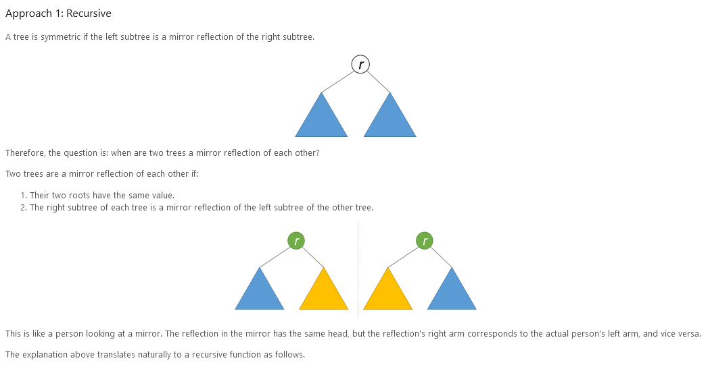
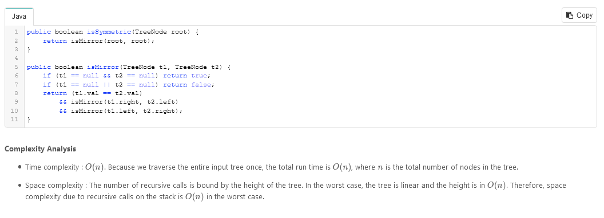
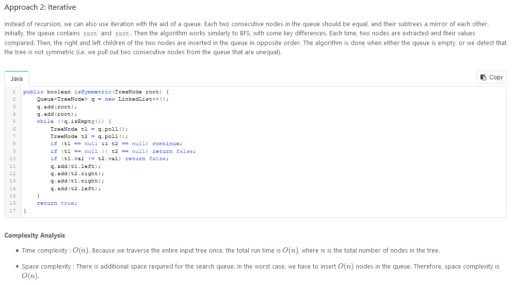

# Symmetric Tree

Given a binary tree, check whether it is a mirror of itself (ie, symmetric around its center).

For example, this binary tree `[1,2,2,3,4,4,3]` is symmetric:

```
    1
   / \
  2   2
 / \ / \
3  4 4  3
```

But the following `[1,2,2,null,3,null,3]` is not:

```
    1
   / \
  2   2
   \   \
   3    3
```

**Follow up:** Solve it both recursively and iteratively.

### Solution:




---



---

```
/**
 * Definition for a binary tree node.
 * function TreeNode(val, left, right) {
 *     this.val = (val===undefined ? 0 : val)
 *     this.left = (left===undefined ? null : left)
 *     this.right = (right===undefined ? null : right)
 * }
 */
/**
 * @param {TreeNode} root
 * @return {boolean}
 */
var isSymmetric = function(root) {

};
```
